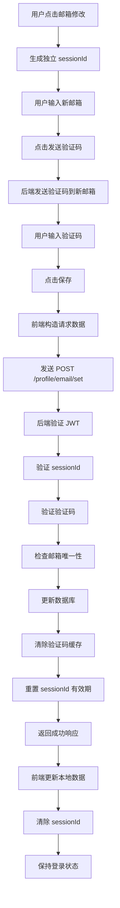
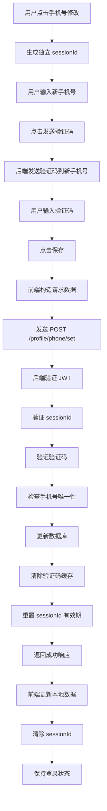

# 邮箱和手机号修改接口实现指南

## 📋 概述

本文档详细说明 `/profile/email/set` 和 `/profile/phone/set` 接口的实现逻辑，参考密码修改接口的设计模式。

**核心特点**：
- ✅ 使用独立的 JWT 令牌进行认证
- ✅ 使用独立的 sessionId 绑定每个修改事件
- ✅ 成功后 **不清除** JWT 令牌（与密码修改不同）
- ✅ 统一的请求格式和响应格式

---

## 🎯 接口设计

### 1. 邮箱修改接口

#### 接口信息
- **URL**: `POST /profile/email/set`
- **Content-Type**: `application/json`
- **认证方式**: Bearer Token (JWT)

#### 请求头
```http
Content-Type: application/json
Authorization: Bearer <JWT_TOKEN>
```

#### 请求体
```json
{
  "sessionId": "邮箱修改专用会话ID",
  "email": "newemail@example.com",
  "verificationCode": "123456"
}
```

**参数说明**：
| 参数 | 类型 | 必填 | 说明 |
|------|------|------|------|
| `sessionId` | String | 是 | 邮箱修改专用的会话 ID（从 Cookie 读取或生成） |
| `email` | String | 是 | 新的邮箱地址 |
| `verificationCode` | String | 是 | 发送到新邮箱的验证码 |

#### 成功响应
```json
{
  "code": 200,
  "success": true,
  "message": "邮箱修改成功"
}
```

#### 失败响应
```json
{
  "code": 400,
  "success": false,
  "message": "验证码错误或已过期"
}
```

---

### 2. 手机号修改接口

#### 接口信息
- **URL**: `POST /profile/phone/set`
- **Content-Type**: `application/json`
- **认证方式**: Bearer Token (JWT)

#### 请求头
```http
Content-Type: application/json
Authorization: Bearer <JWT_TOKEN>
```

#### 请求体
```json
{
  "sessionId": "手机号修改专用会话ID",
  "phone": "13800138000",
  "verificationCode": "123456"
}
```

**参数说明**：
| 参数 | 类型 | 必填 | 说明 |
|------|------|------|------|
| `sessionId` | String | 是 | 手机号修改专用的会话 ID（从 Cookie 读取或生成） |
| `phone` | String | 是 | 新的手机号码 |
| `verificationCode` | String | 是 | 发送到新手机号的验证码 |

#### 成功响应
```json
{
  "code": 200,
  "success": true,
  "message": "手机号修改成功"
}
```

#### 失败响应
```json
{
  "code": 400,
  "success": false,
  "message": "验证码错误或已过期"
}
```

---

## 🔧 后端实现逻辑

### 邮箱修改接口 (`/profile/email/set`)

```java
@PostMapping("/profile/email/set")
public ResponseEntity<Map<String, Object>> setEmail(
        @RequestHeader("Authorization") String authHeader,
        @RequestBody Map<String, String> request) {
    
    Map<String, Object> response = new HashMap<>();
    
    try {
        // 1. 验证 JWT 令牌
        String token = authHeader.replace("Bearer ", "");
        if (!jwtUtil.validateToken(token)) {
            response.put("success", false);
            response.put("message", "无效的认证令牌");
            return ResponseEntity.status(401).body(response);
        }
        
        // 2. 从 JWT 中提取用户 ID
        Long userId = jwtUtil.getUserIdFromToken(token);
        
        // 3. 获取请求参数
        String sessionId = request.get("sessionId");
        String email = request.get("email");
        String verificationCode = request.get("verificationCode");
        
        // 4. 验证参数
        if (sessionId == null || email == null || verificationCode == null) {
            response.put("success", false);
            response.put("message", "缺少必要参数");
            return ResponseEntity.badRequest().body(response);
        }
        
        // 5. 验证 sessionId 是否有效且未过期
        if (!sessionService.isValidSession(sessionId, "email")) {
            response.put("success", false);
            response.put("message", "会话已过期，请重新发送验证码");
            return ResponseEntity.badRequest().body(response);
        }
        
        // 6. 验证邮箱格式
        if (!isValidEmail(email)) {
            response.put("success", false);
            response.put("message", "邮箱格式不正确");
            return ResponseEntity.badRequest().body(response);
        }
        
        // 7. 验证验证码是否正确
        boolean codeValid = verificationService.verifyCode(sessionId, email, verificationCode);
        if (!codeValid) {
            response.put("success", false);
            response.put("message", "验证码错误或已过期");
            return ResponseEntity.badRequest().body(response);
        }
        
        // 8. 检查邮箱是否已被其他用户使用
        if (userService.isEmailExists(email, userId)) {
            response.put("success", false);
            response.put("message", "该邮箱已被其他用户使用");
            return ResponseEntity.badRequest().body(response);
        }
        
        // 9. 更新用户邮箱
        userService.updateEmail(userId, email);
        
        // 10. 清除验证码缓存
        verificationService.clearCode(sessionId);
        
        // 11. 重置 sessionId 有效期
        sessionService.resetSessionExpiry(sessionId, "email");
        
        // 12. 返回成功响应
        response.put("success", true);
        response.put("message", "邮箱修改成功");
        return ResponseEntity.ok(response);
        
    } catch (Exception e) {
        logger.error("邮箱修改失败", e);
        response.put("success", false);
        response.put("message", "系统错误，请稍后重试");
        return ResponseEntity.status(500).body(response);
    }
}
```

### 手机号修改接口 (`/profile/phone/set`)

```java
@PostMapping("/profile/phone/set")
public ResponseEntity<Map<String, Object>> setPhone(
        @RequestHeader("Authorization") String authHeader,
        @RequestBody Map<String, String> request) {
    
    Map<String, Object> response = new HashMap<>();
    
    try {
        // 1. 验证 JWT 令牌
        String token = authHeader.replace("Bearer ", "");
        if (!jwtUtil.validateToken(token)) {
            response.put("success", false);
            response.put("message", "无效的认证令牌");
            return ResponseEntity.status(401).body(response);
        }
        
        // 2. 从 JWT 中提取用户 ID
        Long userId = jwtUtil.getUserIdFromToken(token);
        
        // 3. 获取请求参数
        String sessionId = request.get("sessionId");
        String phone = request.get("phone");
        String verificationCode = request.get("verificationCode");
        
        // 4. 验证参数
        if (sessionId == null || phone == null || verificationCode == null) {
            response.put("success", false);
            response.put("message", "缺少必要参数");
            return ResponseEntity.badRequest().body(response);
        }
        
        // 5. 验证 sessionId 是否有效且未过期
        if (!sessionService.isValidSession(sessionId, "phone")) {
            response.put("success", false);
            response.put("message", "会话已过期，请重新发送验证码");
            return ResponseEntity.badRequest().body(response);
        }
        
        // 6. 验证手机号格式
        if (!isValidPhone(phone)) {
            response.put("success", false);
            response.put("message", "手机号格式不正确");
            return ResponseEntity.badRequest().body(response);
        }
        
        // 7. 验证验证码是否正确
        boolean codeValid = verificationService.verifyCode(sessionId, phone, verificationCode);
        if (!codeValid) {
            response.put("success", false);
            response.put("message", "验证码错误或已过期");
            return ResponseEntity.badRequest().body(response);
        }
        
        // 8. 检查手机号是否已被其他用户使用
        if (userService.isPhoneExists(phone, userId)) {
            response.put("success", false);
            response.put("message", "该手机号已被其他用户使用");
            return ResponseEntity.badRequest().body(response);
        }
        
        // 9. 更新用户手机号
        userService.updatePhone(userId, phone);
        
        // 10. 清除验证码缓存
        verificationService.clearCode(sessionId);
        
        // 11. 重置 sessionId 有效期
        sessionService.resetSessionExpiry(sessionId, "phone");
        
        // 12. 返回成功响应
        response.put("success", true);
        response.put("message", "手机号修改成功");
        return ResponseEntity.ok(response);
        
    } catch (Exception e) {
        logger.error("手机号修改失败", e);
        response.put("success", false);
        response.put("message", "系统错误，请稍后重试");
        return ResponseEntity.status(500).body(response);
    }
}
```

---

## 💻 前端调用示例

### 邮箱修改

```javascript
// ProfileEditView.vue 中的 saveField 函数

if (field === 'email') {
  const newEmail = editForm.value.email
  const emailCode = editForm.value.emailVerificationCode
  
  // 检查新邮箱是否与旧邮箱一致
  if (newEmail === userInfo.value.email) {
    alert('邮箱未发生变化')
    return
  }
  
  // 检查是否已发送验证码
  if (!emailSessionId.value) {
    alert('请先发送邮箱验证码')
    return
  }
  
  // 构造请求数据
  const requestData = {
    sessionId: emailSessionId.value,
    email: newEmail,
    verificationCode: emailCode
  }
  
  logger.info('发送邮箱修改请求:', requestData)
  
  // 发送 POST 请求到 /profile/email/set
  const response = await fetch(PROFILE_API.SET_EMAIL, {
    method: 'POST',
    headers: {
      'Content-Type': 'application/json',
      'Authorization': `Bearer ${token}`
    },
    body: JSON.stringify(requestData)
  })
  
  result = await response.json()
  
  if (response.ok && result.success === true) {
    alert(result.message || '邮箱修改成功！')
    
    // 更新本地数据
    userInfo.value.email = newEmail
    
    // 更新 sessionStorage 缓存
    updateUserInfoField('email', newEmail)
    
    // 更新 localStorage
    localStorage.setItem('userEmail', newEmail)
    
    // 从修改集合中移除
    modifiedFields.value.delete('email')
    
    // 退出编辑模式
    editingField.value = ''
    fieldError.value = ''
    
    // 清除邮箱专用 sessionId
    clearPurposeSessionId('email')
    emailSessionId.value = ''
    editForm.value.emailVerificationCode = ''
    
    // ⚠️ 注意：不清除 JWT 令牌，用户保持登录状态
  } else {
    alert(result.message || '邮箱修改失败')
  }
}
```

### 手机号修改

```javascript
// ProfileEditView.vue 中的 saveField 函数

if (field === 'phone') {
  const newPhone = editForm.value.phone
  const phoneCode = editForm.value.phoneVerificationCode
  
  // 检查新手机号是否与旧手机号一致
  if (newPhone === userInfo.value.phone) {
    alert('手机号未发生变化')
    return
  }
  
  // 检查是否已发送验证码
  if (!phoneSessionId.value) {
    alert('请先发送手机验证码')
    return
  }
  
  // 构造请求数据
  const requestData = {
    sessionId: phoneSessionId.value,
    phone: newPhone,
    verificationCode: phoneCode
  }
  
  logger.info('发送手机号修改请求:', requestData)
  
  // 发送 POST 请求到 /profile/phone/set
  const response = await fetch(PROFILE_API.SET_PHONE, {
    method: 'POST',
    headers: {
      'Content-Type': 'application/json',
      'Authorization': `Bearer ${token}`
    },
    body: JSON.stringify(requestData)
  })
  
  result = await response.json()
  
  if (response.ok && result.success === true) {
    alert(result.message || '手机号修改成功！')
    
    // 更新本地数据
    userInfo.value.phone = newPhone
    
    // 更新 sessionStorage 缓存
    updateUserInfoField('phone', newPhone)
    
    // 更新 localStorage
    localStorage.setItem('userPhone', newPhone)
    
    // 从修改集合中移除
    modifiedFields.value.delete('phone')
    
    // 退出编辑模式
    editingFields.value.delete('phone')
    fieldError.value = ''
    
    // 清除手机号专用 sessionId
    clearPurposeSessionId('phone')
    phoneSessionId.value = ''
    editForm.value.phoneVerificationCode = ''
    
    // ⚠️ 注意：不清除 JWT 令牌，用户保持登录状态
  } else {
    alert(result.message || '手机号修改失败')
  }
}
```

---

## 🔐 安全机制

### 1. JWT 认证
- 所有请求必须携带有效的 JWT 令牌
- 后端验证令牌的签名和有效期
- 从令牌中提取用户 ID，确保操作的是当前用户的账户

### 2. SessionId 验证
- 每个修改操作使用独立的 sessionId
- sessionId 存储在 Cookie 中，有效期 300 秒
- 每次请求成功后重置为 295 秒
- 防止重放攻击和会话劫持

### 3. 验证码验证
- 验证码与 sessionId 和新邮箱/手机号绑定
- 验证码有有效期限制（通常 5 分钟）
- 验证后立即清除，防止重复使用

### 4. 唯一性检查
- 检查新邮箱/手机号是否已被其他用户使用
- 避免账户冲突和数据泄露

### 5. 格式验证
- 邮箱格式验证：`/^[^\s@]+@[^\s@]+\.[^\s@]+$/`
- 手机号格式验证：`/^1[3-9]\d{9}$/`

---

## 📊 工作流程

### 邮箱修改流程



### 手机号修改流程



---

## ⚖️ 与密码修改的区别

| 特性 | 密码修改 | 邮箱/手机号修改 |
|------|---------|----------------|
| 接口 URL | `/profile/password/set` | `/profile/email/set`<br>`/profile/phone/set` |
| 请求方法 | POST | POST |
| 认证方式 | JWT + RSA 加密 | JWT |
| 密码加密 | RSA 加密 | 不需要 |
| 验证码 | 不需要 | 需要 |
| SessionId 用途 | 密码修改专用 | 邮箱/手机号修改专用 |
| **成功后处理** | **清除 JWT**<br>**强制重登录** | **保留 JWT**<br>**保持登录** |
| 安全性要求 | 最高（涉及账户安全） | 高（需要验证码） |

---

## 🧪 测试用例

### 邮箱修改测试

```javascript
// 测试 1: 正常修改邮箱
const test1 = async () => {
  const response = await fetch('/profile/email/set', {
    method: 'POST',
    headers: {
      'Content-Type': 'application/json',
      'Authorization': 'Bearer valid_jwt_token'
    },
    body: JSON.stringify({
      sessionId: 'valid_session_id',
      email: 'newemail@example.com',
      verificationCode: '123456'
    })
  })
  
  const result = await response.json()
  console.assert(result.success === true, '应该成功修改邮箱')
}

// 测试 2: 验证码错误
const test2 = async () => {
  const response = await fetch('/profile/email/set', {
    method: 'POST',
    headers: {
      'Content-Type': 'application/json',
      'Authorization': 'Bearer valid_jwt_token'
    },
    body: JSON.stringify({
      sessionId: 'valid_session_id',
      email: 'newemail@example.com',
      verificationCode: 'wrong_code'
    })
  })
  
  const result = await response.json()
  console.assert(result.success === false, '验证码错误应该失败')
}

// 测试 3: SessionId 过期
const test3 = async () => {
  const response = await fetch('/profile/email/set', {
    method: 'POST',
    headers: {
      'Content-Type': 'application/json',
      'Authorization': 'Bearer valid_jwt_token'
    },
    body: JSON.stringify({
      sessionId: 'expired_session_id',
      email: 'newemail@example.com',
      verificationCode: '123456'
    })
  })
  
  const result = await response.json()
  console.assert(result.success === false, 'SessionId 过期应该失败')
}

// 测试 4: JWT 令牌无效
const test4 = async () => {
  const response = await fetch('/profile/email/set', {
    method: 'POST',
    headers: {
      'Content-Type': 'application/json',
      'Authorization': 'Bearer invalid_jwt_token'
    },
    body: JSON.stringify({
      sessionId: 'valid_session_id',
      email: 'newemail@example.com',
      verificationCode: '123456'
    })
  })
  
  console.assert(response.status === 401, '无效 JWT 应该返回 401')
}
```

### 手机号修改测试

```javascript
// 测试 1: 正常修改手机号
const test1 = async () => {
  const response = await fetch('/profile/phone/set', {
    method: 'POST',
    headers: {
      'Content-Type': 'application/json',
      'Authorization': 'Bearer valid_jwt_token'
    },
    body: JSON.stringify({
      sessionId: 'valid_session_id',
      phone: '13800138000',
      verificationCode: '123456'
    })
  })
  
  const result = await response.json()
  console.assert(result.success === true, '应该成功修改手机号')
}

// 测试 2: 手机号已被使用
const test2 = async () => {
  const response = await fetch('/profile/phone/set', {
    method: 'POST',
    headers: {
      'Content-Type': 'application/json',
      'Authorization': 'Bearer valid_jwt_token'
    },
    body: JSON.stringify({
      sessionId: 'valid_session_id',
      phone: '13800138000', // 已被其他用户使用
      verificationCode: '123456'
    })
  })
  
  const result = await response.json()
  console.assert(result.success === false, '手机号已被使用应该失败')
}
```

---

## 📝 注意事项

### 1. SessionId 管理
- ✅ 使用 `getOrCreatePurposeSessionId('email')` 或 `getOrCreatePurposeSessionId('phone')`
- ✅ 成功后调用 `clearPurposeSessionId('email')` 或 `clearPurposeSessionId('phone')`
- ❌ 不要在不同功能间共用 sessionId

### 2. JWT 令牌
- ✅ 邮箱/手机号修改成功后 **保留** JWT 令牌
- ✅ 用户可以继续操作，无需重新登录
- ❌ 不要像密码修改那样清除 JWT

### 3. 验证码
- ✅ 验证码与 sessionId 和新邮箱/手机号绑定
- ✅ 验证后立即清除
- ❌ 不要允许验证码重复使用

### 4. 唯一性检查
- ✅ 检查新邮箱/手机号是否已被其他用户使用
- ✅ 排除当前用户自己的邮箱/手机号
- ❌ 不要允许两个账户使用相同的邮箱/手机号

### 5. 错误处理
- ✅ 提供清晰的错误提示信息
- ✅ 记录详细的日志
- ❌ 不要暴露敏感信息（如完整的 sessionId）

---

## 🔍 调试技巧

### 1. 查看请求数据
```javascript
logger.info('发送邮箱修改请求:', requestData)
```

### 2. 查看响应数据
```javascript
logger.info('邮箱修改响应:', result)
```

### 3. 检查 Cookie
在浏览器开发者工具中：
- Application → Cookies
- 查看 `sessionId_email` 或 `sessionId_phone`
- 检查有效期时间戳

### 4. 检查控制台日志
- 打开浏览器控制台
- 查看 `logger.info` 和 `logger.error` 输出
- 确认 sessionId 是否正确传递

---

## 📚 相关文件

- **API 配置**: `src/config/api.js`
- **前端视图**: `src/views/ProfileEditView.vue`
- **SessionId 工具**: `src/utils/sessionId.js`
- **邮箱工具**: `src/utils/email.js`
- **手机工具**: `src/utils/phone.js`

---

## ✅ 完成清单

- [x] 添加 API 配置 (`SET_EMAIL`, `SET_PHONE`)
- [x] 修改前端调用逻辑（使用 POST 方法）
- [x] 统一请求参数格式（`sessionId`, `email/phone`, `verificationCode`）
- [x] 成功后不清除 JWT 令牌
- [x] 成功后清除对应的 sessionId
- [x] 更新本地数据和缓存
- [ ] 后端实现 `/profile/email/set` 接口
- [ ] 后端实现 `/profile/phone/set` 接口
- [ ] 后端验证 JWT 令牌
- [ ] 后端验证 sessionId
- [ ] 后端验证验证码
- [ ] 后端检查唯一性
- [ ] 后端更新数据库
- [ ] 后端清除验证码缓存
- [ ] 后端重置 sessionId 有效期

---

**最后更新**: 2026-05-01  
**版本**: v1.0  
**作者**: Lingma AI Assistant
