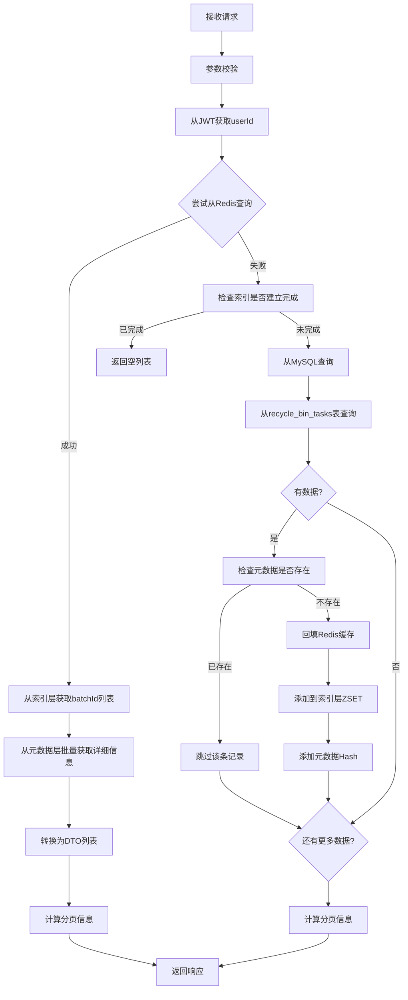

# 回收站浏览接口文档 (RECYCLE_BROWSE.md)

## 📋 概述

回收站浏览接口允许用户查看已删除但尚未过期的文件和文件夹列表。该接口采用**游标分页**机制，支持从Redis缓存或MySQL数据库查询数据。

---

## 🔗 接口信息

### 基本信息
- **路径**: `GET /files/recycle`
- **认证**: 需要JWT Token
- **Content-Type**: `application/json`

### 请求参数

| 参数名 | 类型 | 必填 | 默认值 | 说明 |
|--------|------|------|--------|------|
| maxPageSize | Integer | 否 | 20 | 每页数量，范围1-100 |
| lastBatchId | String | 否 | null | 游标锚点（上一批最后一条的batch_id） |

### 响应格式

```json
{
  "code": 200,
  "success": true,
  "message": "成功",
  "data": {
    "items": [
      {
        "id": 12345,
        "name": "测试文件夹",
        "type": "folder",
        "size": 0,
        "createdAt": "2026-06-01T10:00:00",
        "updatedAt": "2026-06-01T10:00:00",
        "deletedAt": "2026-06-07T15:30:00",
        "expiresAt": "2026-07-07T15:30:00",
        "daysRemaining": 30,
        "version": 1,
        "batchId": "a1b2c3d4-e5f6-7890-abcd-ef1234567890"
      }
    ],
    "pagination": {
      "lastBatchId": "a1b2c3d4-e5f6-7890-abcd-ef1234567890",
      "isEnd": false
    }
  }
}
```

### 响应字段说明

#### items 数组元素
| 字段 | 类型 | 说明 |
|------|------|------|
| id | Long | 节点ID（文件夹或文件ID） |
| name | String | 节点名称 |
| type | String | 节点类型：folder=文件夹，file=文件 |
| size | Long | 文件大小（字节），文件夹为0 |
| createdAt | LocalDateTime | 创建时间 |
| updatedAt | LocalDateTime | 更新时间 |
| deletedAt | LocalDateTime | 删除时间 |
| expiresAt | LocalDateTime | 过期时间（删除后30天） |
| daysRemaining | Integer | 剩余天数 |
| version | Long | 乐观锁版本号 |
| batchId | String | 业务操作批次号（UUID格式） |

#### pagination 对象
| 字段 | 类型 | 说明 |
|------|------|------|
| lastBatchId | String | 下一页的游标锚点 |
| isEnd | Boolean | 是否到达末尾（true=没有更多数据） |

---

## 🏗️ 实现逻辑

### 整体架构

回收站浏览采用**三层缓存架构**：

1. **索引层**（Redis ZSET）：`recycle:user:{userId}:batches`
   - 存储用户的batchId列表
   - Score为删除时间戳，用于排序和游标分页

2. **元数据层**（Redis Hash）：`recycle:batch:{batchId}:info`
   - 存储每个batch的详细信息
   - 包含rootNodeId、nodeType、userId等

3. **降级方案**（MySQL）：`recycle_bin_tasks`表
   - 当Redis不可用时降级到MySQL查询
   - 查询后回填Redis缓存

### 执行流程



### 详细步骤

#### 1. 参数校验（RecycleBinService.browseRecycleBin）
```java
// 默认值处理
if (maxPageSize == null || maxPageSize <= 0) {
    maxPageSize = DEFAULT_MAX_PAGE_SIZE; // 20
}
if (maxPageSize > ABSOLUTE_MAX_PAGE_SIZE) {
    maxPageSize = ABSOLUTE_MAX_PAGE_SIZE; // 100
}
```

#### 2. Redis查询优先
```java
// 从索引层获取batchId列表
Double lastScore = null;
if (lastBatchId != null && !lastBatchId.isEmpty()) {
    lastScore = getBatchScore(userId, lastBatchId);
}

List<String> batchIds = recycleBinRedisService.getUserBatches(
    userId, maxPageSize, lastScore
).join();

// 如果没有数据，降级到MySQL
if (batchIds == null || batchIds.isEmpty()) {
    return browseFromMySQL(userId, maxPageSize, lastBatchId);
}
```

#### 3. 批量获取元数据
```java
// 从元数据层批量获取batch详细信息
Map<String, Map<String, String>> batchInfos = 
    recycleBinRedisService.getBatchInfos(batchIds).join();

// 转换为DTO列表
List<RecycleBinItemDTO> items = new ArrayList<>();
for (String batchId : batchIds) {
    Map<String, String> info = batchInfos.get(batchId);
    if (info != null && !info.isEmpty()) {
        RecycleBinItemDTO item = convertToDTO(batchId, info);
        items.add(item);
    } else {
        // Redis中没有，从MySQL获取
        RecycleBinItemDTO item = getFromMySQL(batchId);
        if (item != null) {
            items.add(item);
        }
    }
}
```

#### 4. MySQL降级方案（带索引检查）
```java
// 【关键】检查 Redis 索引是否已建立完成
boolean indexComplete = isIndexRebuildComplete(userId);

if (indexComplete) {
    // 索引已建立完成，但 Redis 中没有数据，说明用户确实没有回收站项目
    return new RecycleBinBrowseResponse(new ArrayList<>(), 
        new PaginationInfo(null, true));
}

// 索引未建立完成，从 MySQL 查询
List<RecycleBinItemDTO> items = recycleBinTaskMapper.browseRecycleBin(
    userId, maxPageSize, lastBatchId
);

// 如果有数据，回填 Redis 缓存（先检查元数据是否存在）
if (items != null && !items.isEmpty()) {
    warmupRedisCacheWithCheck(userId, items);
}
```

#### 5. 回填 Redis 缓存（带检查）
```java
private void warmupRedisCacheWithCheck(Long userId, List<RecycleBinItemDTO> items) {
    for (RecycleBinItemDTO item : items) {
        String batchId = item.getBatchId();
        
        // 【关键】先检查元数据是否已存在
        String metadataKey = "recycle:batch:" + batchId + ":info";
        Boolean metadataExists = recycleBinRedisService.exists(metadataKey);
        
        if (Boolean.TRUE.equals(metadataExists)) {
            // 元数据已存在，跳过该条记录
            continue;
        }
        
        // 元数据不存在，进行回填
        // 1. 添加 batchId 到用户索引列表
        recycleBinRedisService.addBatchToUserList(userId, batchId, item.getDeletedAt());
        
        // 2. 构建并缓存 batch 详细信息
        Map<String, String> info = buildBatchInfo(item);
        recycleBinRedisService.cacheBatchInfo(batchId, info);
    }
    
    // 刷新用户索引的 TTL
    refreshUserIndexTTL(userId);
}
```

#### 6. 分页信息计算
```java
String newLastBatchId = null;
Boolean isEnd = true;

if (!items.isEmpty()) {
    // 获取最后一项的batchId作为下一页游标
    newLastBatchId = items.get(items.size() - 1).getBatchId();
    
    // 检查是否还有更多数据
    isEnd = !hasMoreItemsInRedis(userId, maxPageSize, newLastBatchId);
}

PaginationInfo pagination = new PaginationInfo(newLastBatchId, isEnd);
```

---

## 🔄 游标分页机制

### 工作原理

1. **第一页**：不传`lastBatchId`，从头开始查询
2. **后续页**：传入上一页返回的`lastBatchId`作为游标
3. **判断结束**：通过`isEnd`字段判断是否还有更多数据

### 示例

```bash
# 第一页
GET /files/recycle?maxPageSize=20

# 第二页（使用第一页返回的lastBatchId）
GET /files/recycle?maxPageSize=20&lastBatchId=a1b2c3d4-e5f6-7890-abcd-ef1234567890
```

---

## 💾 数据源对比

### Redis vs MySQL

| 特性 | Redis | MySQL |
|------|-------|-------|
| 性能 | 快（毫秒级） | 较慢（百毫秒级） |
| 可用性 | 可能失效 | 持久化存储 |
| 数据一致性 | 最终一致 | 强一致 |
| 使用场景 | 正常情况 | 降级方案 |

### 降级策略

- **优先使用Redis**：正常情况下从Redis查询
- **索引检查**：Redis异常时，先检查索引是否建立完成
  - 已完成：返回空列表（说明用户确实没有回收站项目）
  - 未完成：从MySQL查询并回填Redis
- **元数据检查**：回填前先检查元数据是否存在，避免重复写入
- **缓存回填**：MySQL查询后回填Redis，提升后续性能

---

## 🛡️ 错误处理

### 常见错误码

| 错误码 | 说明 | 原因 |
|--------|------|------|
| 401 | 未认证 | JWT Token无效或过期 |
| 40001 | 参数错误 | maxPageSize超出范围 |
| 50001 | 服务器错误 | 系统异常 |

### 错误响应示例

```json
{
  "code": 401,
  "success": false,
  "message": "未认证或会话已过期",
  "data": null
}
```

---

## 📊 性能优化

### 1. 批量查询
- 使用`getBatchInfos()`批量获取元数据，减少Redis交互次数

### 2. 缓存预热
- MySQL查询后回填Redis，避免重复降级
- **元数据检查**：回填前先检查元数据是否存在，避免重复写入

### 3. 索引优化
- Redis ZSET使用score排序，支持高效的游标分页

### 4. 懒加载
- 只在首次访问时创建Redis索引

---

## 🔍 相关接口

### 1. 搜索回收站
- **路径**: `GET /files/recycle/search`
- **功能**: 按关键词搜索回收站内容

### 2. 恢复节点
- **路径**: `POST /files/recycle/restore`
- **功能**: 从回收站恢复节点

### 3. 获取恢复进程
- **路径**: `GET /files/recycle/restore/processes`
- **功能**: 查看正在进行的恢复任务

---

## 📝 注意事项

1. **权限控制**：只能查看当前用户的回收站内容
2. **过期时间**：删除的文件/文件夹30天后自动彻底删除
3. **游标有效性**：`lastBatchId`必须在有效期内（30天）
4. **数据一致性**：Redis和MySQL可能存在短暂不一致
5. **并发安全**：使用事务保证数据完整性

---

## 🧪 测试示例

### cURL测试

```bash
# 第一页
curl -X GET "http://localhost:8080/files/recycle?maxPageSize=20" \
  -H "Authorization: Bearer YOUR_JWT_TOKEN"

# 第二页
curl -X GET "http://localhost:8080/files/recycle?maxPageSize=20&lastBatchId=a1b2c3d4" \
  -H "Authorization: Bearer YOUR_JWT_TOKEN"
```

### JavaScript测试

```javascript
// 第一页
const response1 = await fetch('/files/recycle?maxPageSize=20', {
  headers: {
    'Authorization': 'Bearer YOUR_JWT_TOKEN'
  }
});
const data1 = await response1.json();

// 第二页
const response2 = await fetch(`/files/recycle?maxPageSize=20&lastBatchId=${data1.data.pagination.lastBatchId}`, {
  headers: {
    'Authorization': 'Bearer YOUR_JWT_TOKEN'
  }
});
const data2 = await response2.json();
```

---

## 📚 技术栈

- **Spring Boot**: Web框架
- **MyBatis**: ORM框架
- **Redis**: 缓存层（Lettuce客户端）
- **JWT**: 身份认证
- **Lombok**: 简化代码

---

## 🔄 版本历史

- **v1.0** (2026-06-01): 初始版本，基于MySQL
- **v2.0** (2026-06-07): 新增Redis三层缓存架构
- **v3.0** (2026-06-09): 优化游标分页机制
- **v4.0** (2026-06-09): 
  - 新增索引建立完成检查机制
  - 回填前先检查元数据是否存在，避免重复写入
  - 支持从MySQL查询时按游标断点续传
