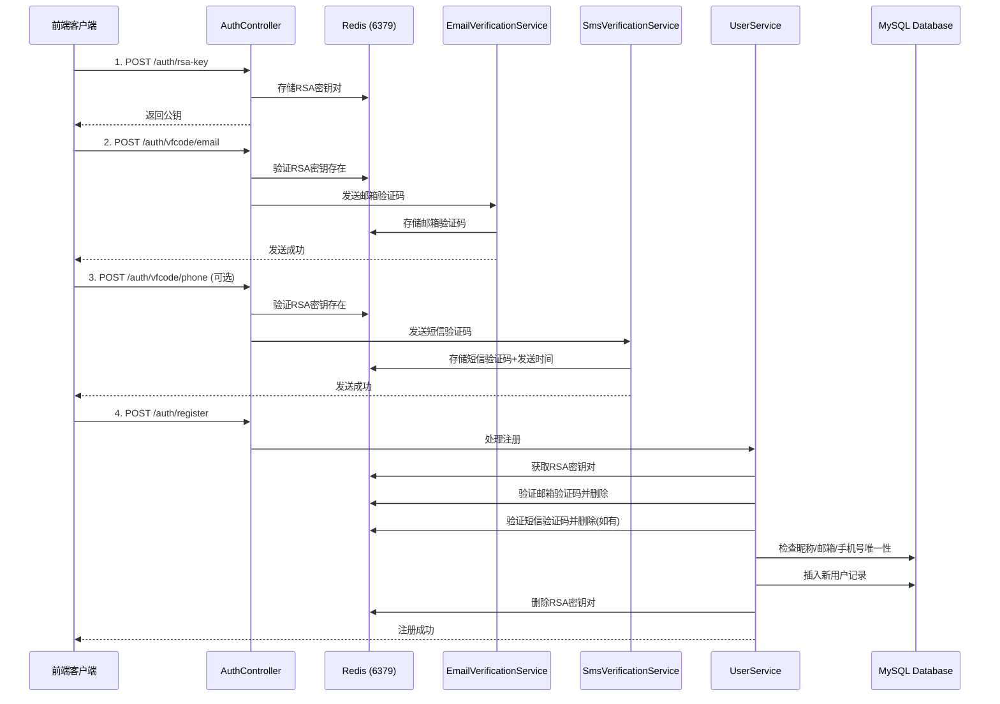

# CloudFileSystem 用户注册完整流程文档

## 概述
本文档详细描述了 CloudFileSystem 系统的用户注册流程，包括所有涉及的接口调用、Redis 缓存变化以及数据库操作。

---

## 注册流程概览



---

## 详细流程说明

### 阶段一：获取 RSA 公钥

#### 接口信息
- **URL**: `POST /auth/rsa-key`
- **Content-Type**: `application/json`
- **请求体**:
```json
{
  "sessionId": "a1b2c3d4-e5f6-7890-abcd-ef1234567890"
}
```

**参数说明**：
- `sessionId`: UUID 格式的会话ID，由前端生成

#### 处理流程
1. 接收前端生成的 `sessionId`（UUID格式）
2. 验证 sessionId 不为空
3. 使用 `RSAKeyManager.generateKeyPair()` 生成 2048 位 RSA 密钥对
4. 将公钥和私钥转换为 Base64 编码
5. 创建 `RSAKeyPairDTO` 对象，包含：
   - publicKey: Base64 编码的公钥
   - privateKey: Base64 编码的私钥
   - timestamp: 当前时间戳
6. 将密钥对存储到 Redis（端口 6379）
7. 设置过期时间为 300 秒（5分钟）
8. 返回公钥给前端（不返回私钥）

#### Redis 变化
**新增键值对**（Redis 端口 6379，使用 rsaRedisTemplate）:
```
Key: rsa:key:a1b2c3d4-e5f6-7890-abcd-ef1234567890
Value: RSAKeyPairDTO {
  publicKey: "MIIBIjANBgkqhkiG9w0BAQEFAAOCAQ8AMIIBCgKCAQEA...",
  privateKey: "MIIEvQIBADANBgkqhkiG9w0BAQEFAASCBKcwggSjAgEAAoIBAQC...",
  timestamp: 1714636800000
}
TTL: 300秒 (5分钟)
序列化方式: Java 对象序列化
```

#### 响应示例
**成功响应** (HTTP 200):
```json
{
  "code": 200,
  "success": true,
  "publicKey": "MIIBIjANBgkqhkiG9w0BAQEFAAOCAQ8AMIIBCgKCAQEA..."
}
```

**失败响应** (HTTP 400):
```json
{
  "code": 400,
  "success": false,
  "message": "sessionId不能为空"
}
```

---

### 阶段二：发送邮箱验证码

#### 接口信息
- **URL**: `POST /auth/vfcode/email`
- **Content-Type**: `application/json`
- **请求体**:
```json
{
  "email": "user@example.com",
  "sessionId": "a1b2c3d4-e5f6-7890-abcd-ef1234567890"
}
```

**参数说明**：
- `email`: 用户邮箱地址
- `sessionId`: 阶段一生成的会话ID

#### 处理流程
1. 验证邮箱地址不为空且格式正确（正则：`^[a-zA-Z0-9._%+-]+@[a-zA-Z0-9.-]+\.[a-zA-Z]{2,}$`）
2. 验证 sessionId 不为空
3. 从 Redis 检查 RSA 密钥对是否存在（`rsa:key:{sessionId}`）
4. 如果密钥对不存在，返回错误："会话已过期，请重新获取公钥"
5. 重置 RSA 密钥对的 TTL 为 300 秒
6. 生成 6 位数字验证码（随机数）
7. 构建 Redis key: `email:code:{sessionId}:{email}`
8. 将验证码存储到 Redis，TTL 为 300 秒（5分钟）
9. 使用 Spring Mail 发送邮箱验证码
   - 发件人：配置中的 `spring.mail.username`
   - 主题：CloudFileSystem - 邮箱验证码
   - 内容：包含验证码和有效期说明
10. 返回成功响应

#### Redis 变化
**新增键值对**（Redis 端口 6379）:
```
Key: email:code:a1b2c3d4-e5f6-7890-abcd-ef1234567890:user@example.com
Value: "123456"
TTL: 300秒 (5分钟)
序列化方式: String
```

**更新键值对**:
```
Key: rsa:key:a1b2c3d4-e5f6-7890-abcd-ef1234567890
操作: EXPIRE
TTL: 重置为 300秒
```

#### 响应示例
**成功响应** (HTTP 200):
```json
{
  "code": 200,
  "success": true,
  "message": "验证码已发送，请查收邮件",
  "data": null
}
```

**失败响应** (HTTP 400):
```json
{
  "code": 400,
  "success": false,
  "message": "会话已过期，请重新获取公钥",
  "data": null
}
```

---

### 阶段三：发送短信验证码（可选）

#### 接口信息
- **URL**: `POST /auth/vfcode/phone`
- **Content-Type**: `application/json`
- **请求体**:
```json
{
  "phoneNumber": "13812345678",
  "sessionId": "a1b2c3d4-e5f6-7890-abcd-ef1234567890"
}
```

**参数说明**：
- `phoneNumber`: 中国大陆手机号（11位，以1开头）
- `sessionId`: 阶段一生成的会话ID

#### 处理流程
1. 验证手机号不为空且格式正确（正则：`^1[3-9]\d{9}$`）
2. 验证 sessionId 不为空
3. 从 Redis 检查 RSA 密钥对是否存在
4. 如果密钥对不存在，返回错误
5. 检查发送频率限制：
   - 查询 `sms:send_time:{phoneNumber}`
   - 如果存在且距离上次发送不足 60 秒，返回错误
6. 重置 RSA 密钥对的 TTL 为 300 秒
7. 生成 6 位数字验证码
8. 调用阿里云短信服务发送验证码
   - 使用 AccessKey ID 和 Secret
   - 模板参数：`{"code":"123456","min":5}`
   - 签名名称和模板代码从配置读取
9. 如果发送成功：
   - 存储验证码到 Redis: `sms:code:{sessionId}:{phoneNumber}`，TTL 300秒
   - 记录发送时间到 Redis: `sms:send_time:{phoneNumber}`，TTL 60秒
10. 返回成功响应

#### Redis 变化
**新增键值对**（Redis 端口 6379）:
```
Key: sms:code:a1b2c3d4-e5f6-7890-abcd-ef1234567890:13812345678
Value: "654321"
TTL: 300秒 (5分钟)
序列化方式: String
```

```
Key: sms:send_time:13812345678
Value: 1714636800000 (当前时间戳，Long类型)
TTL: 60秒
序列化方式: Java 对象序列化
```

**更新键值对**:
```
Key: rsa:key:a1b2c3d4-e5f6-7890-abcd-ef1234567890
操作: EXPIRE
TTL: 重置为 300秒
```

#### 响应示例
**成功响应** (HTTP 200):
```json
{
  "code": 200,
  "success": true,
  "message": "验证码已发送，请注意查收",
  "data": null
}
```

**频率限制响应** (HTTP 429):
```json
{
  "code": 429,
  "success": false,
  "message": "发送过于频繁，请60秒后再试",
  "data": null
}
```

---

### 阶段四：提交注册信息

#### 接口信息
- **URL**: `POST /auth/register`
- **Content-Type**: `application/json`
- **请求体**:
```json
{
  "sessionId": "a1b2c3d4-e5f6-7890-abcd-ef1234567890",
  "data": [
    {
      "nickname": "张三",
      "email": "user@example.com",
      "emailVfCode": "123456",
      "phone": "13812345678",
      "phoneVfCode": "654321",
      "encryptedPassword": "base64_encoded_rsa_encrypted_password",
      "securityQuestion": 1,
      "securityAnswer": "北京"
    }
  ]
}
```

**参数说明**：
- `sessionId`: 阶段一生成的会话ID
- `data`: 注册数据数组（通常只有一个元素）
  - `nickname`: 用户昵称（必填，2-20字符）
  - `email`: 邮箱地址（必填）
  - `emailVfCode`: 邮箱验证码（必填）
  - `phone`: 手机号（可选）
  - `phoneVfCode`: 手机验证码（如果提供了手机号则必填）
  - `encryptedPassword`: RSA 加密后的密码（必填）
  - `securityQuestion`: 安全问题ID（必填）
  - `securityAnswer`: 安全问题答案（必填）

#### 处理流程

##### 步骤 1: 参数验证
- 验证 `data` 数组不为空
- 验证必填字段：nickname, email, encryptedPassword, securityQuestion, securityAnswer
- 验证 sessionId 不为空

##### 步骤 2: 唯一性检查（数据库查询）
```sql
-- 检查昵称是否已存在
SELECT * FROM users WHERE nickname = '张三';

-- 检查邮箱是否已注册
SELECT * FROM users WHERE email = 'user@example.com';

-- 如果提供了手机号，检查是否已注册
SELECT * FROM users WHERE phone = '13812345678';
```

如果任一字段已存在，返回相应错误。

##### 步骤 3: 获取 RSA 密钥对
从 Redis 获取密钥对：
```
GET rsa:key:a1b2c3d4-e5f6-7890-abcd-ef1234567890
```

如果密钥对不存在或已过期，返回错误："会话已过期或无效，请重新获取公钥"

##### 步骤 4: 验证邮箱验证码
从 Redis 获取存储的验证码：
```
GET email:code:a1b2c3d4-e5f6-7890-abcd-ef1234567890:user@example.com
```

比较用户输入的验证码与存储的验证码：
- 如果匹配：删除验证码（一次性使用），继续下一步
- 如果不匹配或不存在：返回错误

##### 步骤 5: 验证手机验证码（如果提供）
如果请求中包含手机号：
```
GET sms:code:a1b2c3d4-e5f6-7890-abcd-ef1234567890:13812345678
```

比较验证码：
- 如果匹配：删除验证码，继续下一步
- 如果不匹配或不存在：返回错误

##### 步骤 6: 解密密码
使用 RSA 私钥解密前端传来的加密密码：
```java
String decryptedPassword = RSAKeyManager.decryptWithPrivateKey(
    encryptedPassword,
    keyPairDTO.getPrivateKey()
);
```

##### 步骤 7: BCrypt 加密密码
使用 BCrypt 算法对明文密码进行哈希加密：
```java
BCryptPasswordEncoder encoder = new BCryptPasswordEncoder();
String bcryptPassword = encoder.encode(decryptedPassword);
// 结果示例: $2a$10$N9qo8uLOickgx2ZMRZoMyeIjZAgcfl7p92ldGxad68LJZdL17lhWy
```

##### 步骤 8: 创建用户记录
插入数据库：
```sql
INSERT INTO users (
  nickname, 
  password, 
  email, 
  phone, 
  storage_quota, 
  storage_used, 
  status, 
  security_question_id, 
  security_answer,
  registered_at,
  last_login_at
) VALUES (
  '张三',
  '$2a$10$N9qo8uLOickgx2ZMRZoMye...',
  'user@example.com',
  '13812345678',
  10737418240,  -- 默认 10GB (10 * 1024 * 1024 * 1024)
  0,            -- 初始使用量为 0
  1,            -- 状态：1-正常
  1,            -- 安全问题ID
  '北京',       -- 安全问题答案
  NOW(),        -- 注册时间
  NOW()         -- 最后登录时间
);
```

##### 步骤 9: 清理 Redis 缓存
注册成功后，删除 RSA 密钥对（一次性使用）：
```
DELETE rsa:key:a1b2c3d4-e5f6-7890-abcd-ef1234567890
```

注意：
- 邮箱验证码已在步骤4验证时删除
- 短信验证码已在步骤5验证时删除
- `sms:send_time:13812345678` 保留，继续倒计时用于频率控制

#### Redis 变化

**删除的键**:
```
DEL rsa:key:a1b2c3d4-e5f6-7890-abcd-ef1234567890
```

之前已删除的键（在验证时）：
```
DEL email:code:a1b2c3d4-e5f6-7890-abcd-ef1234567890:user@example.com
DEL sms:code:a1b2c3d4-e5f6-7890-abcd-ef1234567890:13812345678
```

**保留的键**:
```
Key: sms:send_time:13812345678
Value: 1714636800000
TTL: 继续倒计时（用于频率控制）
```

#### 响应示例
**成功响应** (HTTP 200):
```json
{
  "code": 200,
  "success": true,
  "message": "注册成功",
  "data": [
    {
      "id": 10001,
      "nickname": "张三"
    }
  ]
}
```

**失败响应示例** (HTTP 400):
```json
{
  "code": 400,
  "success": false,
  "message": "昵称已被使用",
  "data": null
}
```

```json
{
  "code": 400,
  "success": false,
  "message": "邮箱验证码错误或已过期",
  "data": null
}
```

---

## Redis 缓存完整生命周期

### 时间线示例

假设用户在 T=0 时刻开始注册流程：

#### T=0s: 获取 RSA 公钥
```redis
SET rsa:key:a1b2c3d4-e5f6-7890-abcd-ef1234567890 = RSAKeyPairDTO
EXPIRE rsa:key:a1b2c3d4-e5f6-7890-abcd-ef1234567890 300
```

**Redis 状态**:
```
┌─────────────────────────────────────────────────────────────────────┐
│ Key: rsa:key:a1b2c3d4-e5f6-7890-abcd-ef1234567890                  │
│ Value: RSAKeyPairDTO(publicKey, privateKey, timestamp)             │
│ TTL: 300s                                                          │
└─────────────────────────────────────────────────────────────────────┘
```

---

#### T=30s: 发送邮箱验证码
```redis
GET rsa:key:a1b2c3d4-e5f6-7890-abcd-ef1234567890
EXPIRE rsa:key:a1b2c3d4-e5f6-7890-abcd-ef1234567890 300
SET email:code:a1b2c3d4-e5f6-7890-abcd-ef1234567890:user@example.com = "123456"
EXPIRE email:code:a1b2c3d4-e5f6-7890-abcd-ef1234567890:user@example.com 300
```

**Redis 状态**:
```
┌─────────────────────────────────────────────────────────────────────┐
│ Key: rsa:key:a1b2c3d4-e5f6-7890-abcd-ef1234567890                  │
│ Value: RSAKeyPairDTO(publicKey, privateKey, timestamp)             │
│ TTL: 300s (重置)                                                    │
├─────────────────────────────────────────────────────────────────────┤
│ Key: email:code:a1b2c3d4-e5f6-7890-abcd-ef1234567890:user@exam...  │
│ Value: "123456"                                                     │
│ TTL: 300s                                                           │
└─────────────────────────────────────────────────────────────────────┘
```

---

#### T=60s: 发送短信验证码
```redis
GET rsa:key:a1b2c3d4-e5f6-7890-abcd-ef1234567890
EXPIRE rsa:key:a1b2c3d4-e5f6-7890-abcd-ef1234567890 300
SET sms:code:a1b2c3d4-e5f6-7890-abcd-ef1234567890:13812345678 = "654321"
EXPIRE sms:code:a1b2c3d4-e5f6-7890-abcd-ef1234567890:13812345678 300
SET sms:send_time:13812345678 = 1714636860000
EXPIRE sms:send_time:13812345678 60
```

**Redis 状态**:
```
┌─────────────────────────────────────────────────────────────────────┐
│ Key: rsa:key:a1b2c3d4-e5f6-7890-abcd-ef1234567890                  │
│ Value: RSAKeyPairDTO(publicKey, privateKey, timestamp)             │
│ TTL: 300s (重置)                                                    │
├─────────────────────────────────────────────────────────────────────┤
│ Key: email:code:a1b2c3d4-e5f6-7890-abcd-ef1234567890:user@exam...  │
│ Value: "123456"                                                     │
│ TTL: 270s                                                           │
├─────────────────────────────────────────────────────────────────────┤
│ Key: sms:code:a1b2c3d4-e5f6-7890-abcd-ef1234567890:13812345678     │
│ Value: "654321"                                                     │
│ TTL: 300s                                                           │
├─────────────────────────────────────────────────────────────────────┤
│ Key: sms:send_time:13812345678                                      │
│ Value: 1714636860000                                                │
│ TTL: 60s                                                            │
└─────────────────────────────────────────────────────────────────────┘
```

---

#### T=120s: 提交注册
```redis
GET rsa:key:a1b2c3d4-e5f6-7890-abcd-ef1234567890
GET email:code:a1b2c3d4-e5f6-7890-abcd-ef1234567890:user@example.com
DEL email:code:a1b2c3d4-e5f6-7890-abcd-ef1234567890:user@example.com
GET sms:code:a1b2c3d4-e5f6-7890-abcd-ef1234567890:13812345678
DEL sms:code:a1b2c3d4-e5f6-7890-abcd-ef1234567890:13812345678
DEL rsa:key:a1b2c3d4-e5f6-7890-abcd-ef1234567890
```

**Redis 状态**:
```
┌─────────────────────────────────────────────────────────────────────┐
│ Key: sms:send_time:13812345678                                      │
│ Value: 1714636860000                                                │
│ TTL: 0s (即将过期)                                                   │
└─────────────────────────────────────────────────────────────────────┘
```

**最终状态**：除了频率控制的 `sms:send_time` 键外，所有注册相关的键都被清理。

---

## 数据库表结构

### users 表

| 字段名 | 类型 | 说明 | 约束 | 默认值 |
|--------|------|------|------|--------|
| id | BIGINT | 用户ID（主键） | PRIMARY KEY, AUTO_INCREMENT | - |
| nickname | VARCHAR(50) | 昵称 | UNIQUE, NOT NULL | - |
| password | VARCHAR(255) | BCrypt加密密码 | NOT NULL | - |
| email | VARCHAR(100) | 邮箱 | UNIQUE, NOT NULL | - |
| phone | VARCHAR(20) | 手机号 | UNIQUE | NULL |
| avatar | TEXT | 头像（Base64或URL） | - | NULL |
| storage_quota | BIGINT | 存储配额（字节） | NOT NULL | 10737418240 (10GB) |
| storage_used | BIGINT | 已使用存储（字节） | NOT NULL | 0 |
| status | TINYINT | 账号状态 | NOT NULL | 1 |
| security_question_id | INT | 安全问题ID | NOT NULL | - |
| security_answer | VARCHAR(255) | 安全问题答案 | NOT NULL | - |
| registered_at | DATETIME | 注册时间 | NOT NULL | CURRENT_TIMESTAMP |
| last_login_at | DATETIME | 最后登录时间 | NOT NULL | CURRENT_TIMESTAMP |

**状态码说明**：
- 0: 禁用
- 1: 正常
- 2: 锁定

**索引**：
- PRIMARY KEY: `id`
- UNIQUE KEY: `nickname`
- UNIQUE KEY: `email`
- UNIQUE KEY: `phone`

---

## 安全机制

### 1. RSA 非对称加密
- **用途**：保护敏感数据（密码）在传输过程中的安全
- **密钥长度**：2048 位
- **工作流程**：
  1. 后端生成密钥对，公钥发送给前端
  2. 前端使用公钥加密密码
  3. 后端使用私钥解密
  4. 密钥对仅存储 5 分钟，使用后自动删除
- **安全性**：即使中间人截获数据，也无法解密（没有私钥）

### 2. 双重验证码机制
- **邮箱验证码**：
  - 6 位数字
  - 有效期 5 分钟
  - 一次性使用（验证后删除）
  
- **短信验证码**（可选）：
  - 6 位数字
  - 有效期 5 分钟
  - 一次性使用
  - 发送频率限制：60 秒间隔

### 3. 密码安全存储
- **算法**：BCrypt
- **特点**：
  - 自动加盐（salt）
  - 不可逆哈希
  - 抗彩虹表攻击
  - 可调节计算成本（默认 strength=10）
- **示例**：
  ```
  明文: "MyPassword123"
  BCrypt: "$2a$10$N9qo8uLOickgx2ZMRZoMyeIjZAgcfl7p92ldGxad68LJZdL17lhWy"
  ```

### 4. Session 管理
- **sessionId 格式**：UUID v4
- **生命周期**：
  - 初始 TTL：300 秒
  - 每次操作重置 TTL
  - 注册成功后删除
- **防劫持措施**：
  - 短时间有效
  - 绑定 RSA 密钥对
  - 一次性使用

### 5. 输入验证
- 邮箱格式验证（正则表达式）
- 手机号格式验证（中国大陆标准）
- 昵称长度限制（2-20字符）
- 昵称字符限制（中文、英文、数字、下划线）
- SQL 注入防护（使用 MyBatis 参数化查询）

---

## 错误处理

### HTTP 状态码

| 状态码 | 说明 | 常见场景 |
|--------|------|----------|
| 200 | 成功 | 请求成功处理 |
| 400 | 请求错误 | 参数缺失、格式错误、验证码错误 |
| 401 | 未授权 | 会话过期、密钥对无效 |
| 403 | 禁止访问 | 账号被禁用或锁定 |
| 409 | 冲突 | 昵称/邮箱/手机号已存在 |
| 429 | 请求过于频繁 | 短信发送间隔小于60秒 |
| 500 | 服务器内部错误 | 数据库异常、Redis异常、邮件发送失败 |

### 错误响应格式

```json
{
  "code": 400,
  "success": false,
  "message": "具体的错误描述信息",
  "data": null
}
```

### 常见错误消息

| 错误消息 | 触发条件 | 解决方案 |
|----------|----------|----------|
| sessionId不能为空 | 请求中缺少 sessionId | 检查前端是否正确传递 |
| 会话已过期，请重新获取公钥 | RSA 密钥对已过期或被删除 | 重新调用 /auth/rsa-key |
| 邮箱格式不正确 | 邮箱不符合标准格式 | 检查邮箱地址格式 |
| 验证码错误或已过期 | 验证码不匹配或超过5分钟 | 重新获取验证码 |
| 昵称已被使用 | 数据库中已存在该昵称 | 更换昵称 |
| 邮箱已被注册 | 数据库中已存在该邮箱 | 使用其他邮箱或直接登录 |
| 手机号已被注册 | 数据库中已存在该手机号 | 使用其他手机号 |
| 发送过于频繁，请60秒后再试 | 距上次短信发送不足60秒 | 等待后重试 |
| 注册失败：XXX | 数据库插入失败或其他异常 | 检查日志，联系管理员 |

---

## 日志记录

### 日志级别

- **INFO**: 正常业务流程（注册成功、验证码发送成功等）
- **WARN**: 警告信息（参数验证失败、验证码错误等）
- **ERROR**: 错误信息（异常、系统故障等）
- **DEBUG**: 调试信息（Redis 操作详情等）

### 关键日志点

#### 1. RSA 密钥生成
```
[获取RSA公钥] 密钥已存入Redis - Key: rsa:key:xxx, TTL: 300秒
[获取RSA公钥] 成功 - SessionId: xxx
```

#### 2. 邮箱验证码发送
```
[发送验证码] 生成验证码 - Email: user@example.com, SessionId: xxx, Code: 123456
[发送验证码] 验证码已存入Redis - Key: email:code:xxx:user@example.com, TTL: 5分钟
[邮件发送] 成功 - From: noreply@example.com, To: user@example.com
[发送邮箱验证码] 成功 - Email: user@example.com, SessionId: xxx
```

#### 3. 短信验证码发送
```
[发送短信验证码] 生成验证码 - Phone: 13812345678, SessionId: xxx, Code: 654321
[阿里云号码认证] 发送成功 - Phone: 13812345678, RequestId: xxx
[发送短信验证码] 验证码已存入Redis - Key: sms:code:xxx:13812345678, TTL: 5分钟
[发送短信验证码] 发送时间已记录 - Phone: 13812345678
[发送短信验证码] 成功 - Phone: 13812345678, SessionId: xxx
```

#### 4. 验证码验证
```
[验证验证码] 成功 - SessionId: xxx, Email: user@example.com
[验证短信验证码] 成功 - SessionId: xxx, Phone: 13812345678
```

#### 5. 用户注册
```
[用户注册] 成功 - UserId: 10001, Nickname: 张三, Email: user@example.com
```

#### 6. 错误日志
```
[发送邮箱验证码] 失败 - Email: user@example.com
[用户注册] 失败 - 昵称已被使用
[用户注册] 异常 - NullPointerException ...
```

### 日志配置建议

在 `application.yaml` 中配置：
```yaml
logging:
  level:
    com.mizuka.cloudfilesystem: INFO
    com.mizuka.cloudfilesystem.controller.AuthController: DEBUG
    com.mizuka.cloudfilesystem.service.UserService: DEBUG
  pattern:
    console: "%d{yyyy-MM-dd HH:mm:ss} [%thread] %-5level %logger{36} - %msg%n"
  file:
    name: logs/cloudfilesystem.log
```

---

## 性能优化建议

### 1. Redis 优化

#### 连接池配置
```yaml
spring:
  redis:
    lettuce:
      pool:
        max-active: 20      # 最大活跃连接数
        max-idle: 10        # 最大空闲连接数
        min-idle: 5         # 最小空闲连接数
        max-wait: 3000ms    # 最大等待时间
```

#### 内存管理
- 监控 Redis 内存使用情况
- 设置最大内存限制
- 配置淘汰策略（推荐 allkeys-lru）

```yaml
spring:
  redis:
    redisson:
      config: |
        maxmemory: 2gb
        maxmemory-policy: allkeys-lru
```

#### 键命名规范
- 使用统一前缀便于管理和清理
- 示例：
  - `rsa:key:*` - RSA 密钥对
  - `email:code:*` - 邮箱验证码
  - `sms:code:*` - 短信验证码
  - `sms:send_time:*` - 短信发送时间

### 2. 数据库优化

#### 索引优化
确保以下字段有唯一索引：
```sql
ALTER TABLE users ADD UNIQUE INDEX idx_nickname (nickname);
ALTER TABLE users ADD UNIQUE INDEX idx_email (email);
ALTER TABLE users ADD UNIQUE INDEX idx_phone (phone);
```

#### 事务管理
注册过程应在事务中执行：
```java
@Transactional
public RegisterResponse register(RegisterRequest request) {
    // 所有数据库操作在一个事务中
    // 任何步骤失败都会回滚
}
```

#### 连接池配置
```yaml
spring:
  datasource:
    hikari:
      maximum-pool-size: 20
      minimum-idle: 5
      connection-timeout: 30000
      idle-timeout: 600000
      max-lifetime: 1800000
```

### 3. 缓存策略

#### TTL 设置原则
- RSA 密钥对：300 秒（5分钟）- 足够完成注册流程
- 验证码：300 秒（5分钟）- 平衡安全性和用户体验
- 发送时间：60 秒 - 严格的频率控制

#### 及时清理
- 验证码验证后立即删除
- RSA 密钥对注册成功后删除
- 避免缓存泄漏

### 4. 异步处理

考虑将邮件和短信发送改为异步：
```java
@Async
public void sendEmailAsync(String to, String code) {
    // 异步发送邮件
}
```

---

## 测试用例

### 完整注册流程测试

#### 1. 获取 RSA 公钥
```bash
curl -X POST http://localhost:8080/auth/rsa-key \
  -H "Content-Type: application/json" \
  -d '{
    "sessionId": "test-session-uuid-12345"
  }'
```

预期响应：
```json
{
  "code": 200,
  "success": true,
  "publicKey": "MIIBIjANBgkqhkiG9w0BAQEFAAOCAQ8AMIIBCgKCAQEA..."
}
```

#### 2. 发送邮箱验证码
```bash
curl -X POST http://localhost:8080/auth/vfcode/email \
  -H "Content-Type: application/json" \
  -d '{
    "email": "test@example.com",
    "sessionId": "test-session-uuid-12345"
  }'
```

预期响应：
```json
{
  "code": 200,
  "success": true,
  "message": "验证码已发送，请查收邮件",
  "data": null
}
```

#### 3. 发送短信验证码（可选）
```bash
curl -X POST http://localhost:8080/auth/vfcode/phone \
  -H "Content-Type: application/json" \
  -d '{
    "phoneNumber": "13812345678",
    "sessionId": "test-session-uuid-12345"
  }'
```

预期响应：
```json
{
  "code": 200,
  "success": true,
  "message": "验证码已发送，请注意查收",
  "data": null
}
```

#### 4. 提交注册
```bash
curl -X POST http://localhost:8080/auth/register \
  -H "Content-Type: application/json" \
  -d '{
    "sessionId": "test-session-uuid-12345",
    "data": [{
      "nickname": "测试用户",
      "email": "test@example.com",
      "emailVfCode": "123456",
      "phone": "13812345678",
      "phoneVfCode": "654321",
      "encryptedPassword": "BASE64_ENCODED_ENCRYPTED_PASSWORD",
      "securityQuestion": 1,
      "securityAnswer": "北京"
    }]
  }'
```

预期响应：
```json
{
  "code": 200,
  "success": true,
  "message": "注册成功",
  "data": [
    {
      "id": 10001,
      "nickname": "测试用户"
    }
  ]
}
```

### 边界测试用例

#### 测试 1: 重复昵称
```bash
# 使用已存在的昵称注册
curl -X POST http://localhost:8080/auth/register \
  -H "Content-Type: application/json" \
  -d '{
    "sessionId": "test-session-uuid-12345",
    "data": [{
      "nickname": "已存在的昵称",
      "email": "new@example.com",
      "emailVfCode": "123456",
      "encryptedPassword": "...",
      "securityQuestion": 1,
      "securityAnswer": "答案"
    }]
  }'
```

预期响应：
```json
{
  "code": 400,
  "success": false,
  "message": "昵称已被使用",
  "data": null
}
```

#### 测试 2: 验证码错误
```bash
curl -X POST http://localhost:8080/auth/register \
  -H "Content-Type: application/json" \
  -d '{
    "sessionId": "test-session-uuid-12345",
    "data": [{
      "nickname": "新用户",
      "email": "new@example.com",
      "emailVfCode": "999999",
      "encryptedPassword": "...",
      "securityQuestion": 1,
      "securityAnswer": "答案"
    }]
  }'
```

预期响应：
```json
{
  "code": 400,
  "success": false,
  "message": "邮箱验证码错误或已过期",
  "data": null
}
```

#### 测试 3: 会话过期
```bash
# 等待 5 分钟后提交注册
curl -X POST http://localhost:8080/auth/register \
  -H "Content-Type: application/json" \
  -d '{
    "sessionId": "old-session-uuid",
    "data": [{
      "nickname": "新用户",
      "email": "new@example.com",
      "emailVfCode": "123456",
      "encryptedPassword": "...",
      "securityQuestion": 1,
      "securityAnswer": "答案"
    }]
  }'
```

预期响应：
```json
{
  "code": 400,
  "success": false,
  "message": "会话已过期或无效，请重新获取公钥",
  "data": null
}
```

#### 测试 4: 短信频率限制
```bash
# 第一次发送
curl -X POST http://localhost:8080/auth/vfcode/phone \
  -H "Content-Type: application/json" \
  -d '{
    "phoneNumber": "13812345678",
    "sessionId": "test-session-uuid-12345"
  }'

# 30秒后再次发送
sleep 30
curl -X POST http://localhost:8080/auth/vfcode/phone \
  -H "Content-Type: application/json" \
  -d '{
    "phoneNumber": "13812345678",
    "sessionId": "test-session-uuid-12345"
  }'
```

第二次预期响应：
```json
{
  "code": 429,
  "success": false,
  "message": "发送过于频繁，请60秒后再试",
  "data": null
}
```

---

## 监控与告警

### 关键指标

#### Redis 监控
- 内存使用率
- 键数量（按前缀分类）
- 命中率
- 连接数

#### 数据库监控
- 注册用户数（按时间段）
- 注册成功率
- 平均注册耗时
- 慢查询数量

#### 业务指标
- 邮箱验证码发送成功率
- 短信验证码发送成功率
- 注册转化率（获取公钥 -> 完成注册）
- 验证码错误率

### 告警规则

| 指标 | 阈值 | 动作 |
|------|------|------|
| Redis 内存使用率 | > 80% | 发送告警，检查是否有内存泄漏 |
| 注册失败率 | > 10% (5分钟内) | 发送告警，检查系统状态 |
| 短信发送失败率 | > 5% (10分钟内) | 检查阿里云服务状态 |
| 邮件发送失败率 | > 5% (10分钟内) | 检查邮件服务器状态 |
| 平均注册耗时 | > 10秒 | 检查系统性能瓶颈 |

---

## 常见问题 FAQ

### Q1: 为什么注册需要 RSA 加密？
**A**: RSA 加密确保密码在传输过程中不会被窃取。即使 HTTPS 被破解或中间人攻击，攻击者也无法解密密码，因为只有后端持有私钥。

### Q2: 验证码为什么是一次性的？
**A**: 一次性使用可以防止重放攻击。即使验证码被截获，也只能使用一次，提高了安全性。

### Q3: 手机号是必填的吗？
**A**: 不是。手机号是可选字段。但如果提供了手机号，就必须验证手机验证码。

### Q4: 注册后可以修改邮箱或手机号吗？
**A**: 可以。系统提供了个人资料修改功能，但需要验证原密码和新邮箱/手机号的验证码。

### Q5: 如果注册过程中断怎么办？
**A**: 
- RSA 密钥对会在 5 分钟后自动过期
- 验证码会在 5 分钟后自动过期
- 用户可以重新开始注册流程
- 不会产生脏数据（数据库事务保证）

### Q6: 如何防止恶意注册？
**A**: 
- 邮箱和手机验证码增加了注册成本
- 短信发送频率限制（60秒间隔）
- 可以添加 IP 限制、CAPTCHA 等额外措施
- 监控异常注册行为

### Q7: Redis 挂了会影响注册吗？
**A**: 会。Redis 用于存储 RSA 密钥对和验证码，如果 Redis 不可用，注册流程无法完成。建议：
- 使用 Redis 集群提高可用性
- 配置哨兵模式实现自动故障转移
- 监控 Redis 健康状态

---

## 总结

CloudFileSystem 的用户注册流程采用了多层安全机制和最佳实践：

### 安全特性
✅ **传输层安全**：RSA 非对称加密保护敏感数据  
✅ **验证层安全**：邮箱和短信双重验证  
✅ **存储层安全**：BCrypt 密码哈希，不可逆  
✅ **会话管理**：短期有效的 sessionId，防止重放攻击  
✅ **输入验证**：严格的格式和长度校验  

### 性能优化
✅ **Redis 缓存**：快速存取验证码和密钥对  
✅ **合理 TTL**：平衡安全性和资源占用  
✅ **及时清理**：避免缓存泄漏  
✅ **索引优化**：加速数据库查询  

### 可靠性
✅ **事务管理**：保证数据一致性  
✅ **错误处理**：清晰的错误提示和日志  
✅ **频率限制**：防止滥用和攻击  
✅ **监控告警**：及时发现和处理问题  

### 可扩展性
✅ **模块化设计**：各服务职责清晰  
✅ **配置化**：易于调整参数  
✅ **异步支持**：可扩展为异步处理  
✅ **标准化接口**：RESTful API 设计  

整个注册流程通过精心设计的 Redis 缓存策略实现了高效的狀態管理和安全保障，为用户提供安全、流畅的注册体验。

---

**文档版本**: v1.0  
**创建日期**: 2026-05-02  
**最后更新**: 2026-05-02  
**维护者**: CloudFileSystem 开发团队  
**技术栈**: Spring Boot, MyBatis, Redis, MySQL, Spring Mail, 阿里云短信
