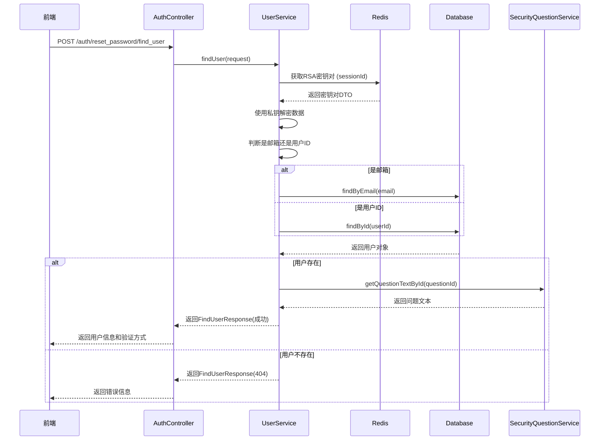

# 重置密码 - 查找用户接口实现文档

## 📋 接口概述

实现了重置密码的第一步：查找用户信息。该接口根据用户ID或邮箱查找用户，并返回可用的验证方式（邮箱、手机号、密保问题）。

---

## 🔧 实现内容

### 1. 新增DTO类

#### FindUserRequest.java
**路径**: `src/main/java/com/mizuka/cloudfilesystem/dto/FindUserRequest.java`

**字段**:
- `sessionId`: String - 会话ID，用于获取RSA密钥对
- `encryptedUserIdOrEmail`: String - RSA加密的用户ID或邮箱地址

---

#### FindUserResponse.java
**路径**: `src/main/java/com/mizuka/cloudfilesystem/dto/FindUserResponse.java`

**字段**:
- `code`: int - 响应代码
- `success`: boolean - 是否成功
- `message`: String - 响应消息
- `email`: String - 用户邮箱（可能为空字符串）
- `phone`: String - 手机号（可能为空字符串）
- `securityQuestion`: Integer - 密保问题序号（可能为null）
- `securityQuestionText`: String - 密保问题文本（可能为空字符串）

---

### 2. 修改的文件

#### SecurityQuestionMapper.java
**新增方法**:
```java
@Select("SELECT id, question_text, created_at FROM security_questions WHERE id = #{id}")
SecurityQuestion selectById(Integer id);
```

**作用**: 根据ID查询安全问题

---

#### SecurityQuestionService.java
**新增方法**:
```java
public String getQuestionTextById(Integer questionId)
```

**作用**: 根据问题ID获取问题文本

---

#### UserService.java
**新增方法**:
```java
public FindUserResponse findUser(FindUserRequest request)
```

**功能**:
1. 验证请求参数（sessionId、加密数据）
2. 从Redis获取RSA密钥对
3. 使用私钥解密用户ID或邮箱
4. 判断是邮箱还是用户ID（通过是否包含@符号）
5. 查询数据库获取用户信息
6. 返回用户信息和可用的验证方式

**关键逻辑**:
```java
// 判断是邮箱还是用户ID
if (userIdOrEmail.contains("@")) {
    // 按邮箱查询
    user = userMapper.findByEmail(userIdOrEmail);
} else {
    // 按用户ID查询
    Long userId = Long.parseLong(userIdOrEmail);
    user = userMapper.findById(userId);
}
```

---

#### AuthController.java
**新增接口**:
```java
@PostMapping("/reset_password/find_user")
public ResponseEntity<FindUserResponse> findUser(@RequestBody FindUserRequest request)
```

**路径**: `POST /auth/reset_password/find_user`

**功能**: 接收前端请求，调用UserService查找用户，返回响应

---

## 📊 业务流程



---

## 🎯 接口详情

### 请求示例

```bash
curl -X POST http://localhost:8835/auth/reset_password/find_user \
  -H "Content-Type: application/json" \
  -d '{
    "sessionId": "abc-123-def-456",
    "encryptedUserIdOrEmail": "base64_encoded_encrypted_data"
  }'
```

---

### 成功响应 (HTTP 200)

```json
{
  "code": 200,
  "success": true,
  "message": "找到用户",
  "id": 10001,
  "email": "user@example.com",
  "phone": "138****5678",
  "securityQuestion": 1,
  "securityQuestionText": "您的出生地是？"
}
```

**字段说明**:
- `id`: Long - 用户ID
- `email`: String - 如果用户未设置邮箱，返回空字符串 `""`
- `phone`: String - 如果用户未设置手机号，返回空字符串 `""`
- `securityQuestion`: Integer - 如果用户未设置密保问题，返回 `null`
- `securityQuestionText`: String - 如果用户未设置密保问题，返回空字符串 `""`

---

### 失败响应

#### 会话过期 (HTTP 400)
```json
{
  "code": 400,
  "success": false,
  "message": "会话已过期或无效，请重新获取公钥",
  "id": null,
  "email": null,
  "phone": null,
  "securityQuestion": null,
  "securityQuestionText": null
}
```

#### 用户不存在 (HTTP 404)
```json
{
  "code": 404,
  "success": false,
  "message": "未找到该用户，请检查输入",
  "id": null,
  "email": null,
  "phone": null,
  "securityQuestion": null,
  "securityQuestionText": null
}
```

#### 解密失败 (HTTP 400)
```json
{
  "code": 400,
  "success": false,
  "message": "解密失败，请确认使用的公钥正确",
  "id": null,
  "email": null,
  "phone": null,
  "securityQuestion": null,
  "securityQuestionText": null
}
```

---

## 🔐 安全特性

### 1. RSA加密传输
- 用户ID或邮箱使用RSA公钥加密后传输
- 后端使用私钥解密
- 防止敏感信息泄露

### 2. SessionId验证
- 必须提供有效的sessionId
- sessionId对应的密钥对有5分钟有效期
- 防止重放攻击

### 3. 不返回敏感信息
- 只返回邮箱、手机号、密保问题
- 不返回密码、用户ID等敏感信息
- 保护用户隐私

---

## 📝 日志记录

### 关键日志点

1. **开始处理**
   ```
   [查找用户] 开始处理 - SessionId: abc-123-def
   ```

2. **RSA密钥对获取**
   ```
   [查找用户] RSA密钥对获取成功 - SessionId: abc-123-def
   ```

3. **解密完成**
   ```
   [查找用户] 解密完成 - SessionId: abc-123-def, 数据类型: 邮箱
   ```

4. **查询用户**
   ```
   [查找用户] 按邮箱查询 - Email: user@example.com
   [查找用户] 按用户ID查询 - UserId: 10001
   ```

5. **查找成功**
   ```
   [查找用户] 成功 - UserId: 10001, Nickname: 张三
   ```

6. **返回验证方式**
   ```
   [查找用户] 返回验证方式 - Email: 已设置, Phone: 已设置, SecurityQuestion: 已设置
   ```

7. **查找失败**
   ```
   [查找用户] 失败 - 未找到用户, 查询条件: user@example.com
   ```

---

## 🧪 测试方法

### 1. 准备测试数据

```javascript
// 1. 生成sessionId
const sessionId = crypto.randomUUID();

// 2. 获取RSA公钥
const rsaResponse = await fetch('/auth/rsa-key', {
  method: 'POST',
  headers: { 'Content-Type': 'application/json' },
  body: JSON.stringify({ sessionId })
});
const rsaData = await rsaResponse.json();
const publicKey = rsaData.publicKey;

// 3. 加密用户ID或邮箱
const encryptedData = encryptWithPublicKey('user@example.com', publicKey);

// 4. 调用查找用户接口
const response = await fetch('/auth/reset_password/find_user', {
  method: 'POST',
  headers: { 'Content-Type': 'application/json' },
  body: JSON.stringify({
    sessionId: sessionId,
    encryptedUserIdOrEmail: encryptedData
  })
});

const result = await response.json();
console.log(result);
```

---

### 2. 测试场景

#### 场暯1：按邮箱查找（用户存在）
```json
// 请求
{
  "sessionId": "test-session-1",
  "encryptedUserIdOrEmail": "encrypted_user@example.com"
}

// 响应
{
  "code": 200,
  "success": true,
  "message": "找到用户",
  "id": 10001,
  "email": "user@example.com",
  "phone": "13800138000",
  "securityQuestion": 1,
  "securityQuestionText": "您的出生地是？"
}
```

---

#### 场曯2：按用户ID查找（用户存在）
```json
// 请求
{
  "sessionId": "test-session-2",
  "encryptedUserIdOrEmail": "encrypted_10001"
}

// 响应
{
  "code": 200,
  "success": true,
  "message": "找到用户",
  "id": 10001,
  "email": "user@example.com",
  "phone": "",
  "securityQuestion": null,
  "securityQuestionText": ""
}
```

---

#### 场景3：用户不存在
```json
// 请求
{
  "sessionId": "test-session-3",
  "encryptedUserIdOrEmail": "encrypted_nonexistent@example.com"
}

// 响应
{
  "code": 404,
  "success": false,
  "message": "未找到该用户，请检查输入",
  "email": null,
  "phone": null,
  "securityQuestion": null,
  "securityQuestionText": null
}
```

---

#### 场景4：会话过期
```json
// 请求
{
  "sessionId": "expired-session",
  "encryptedUserIdOrEmail": "encrypted_data"
}

// 响应
{
  "code": 400,
  "success": false,
  "message": "会话已过期或无效，请重新获取公钥",
  "email": null,
  "phone": null,
  "securityQuestion": null,
  "securityQuestionText": null
}
```

---

## ⚠️ 注意事项

### 1. 前端加密

前端必须使用正确的RSA公钥加密数据：
```javascript
// 使用 jsencrypt 库
import JSEncrypt from 'jsencrypt';

function encryptWithPublicKey(data, publicKey) {
  const encrypt = new JSEncrypt();
  encrypt.setPublicKey(publicKey);
  return encrypt.encrypt(data);
}
```

---

### 2. SessionId管理

- SessionId应该在使用前通过 `/auth/rsa-key` 获取
- SessionId有效期为5分钟
- 每次获取公钥都会生成新的密钥对

---

### 3. 数据格式

- 邮箱：必须包含 `@` 符号
- 用户ID：必须是纯数字
- 如果输入既不是邮箱也不是数字，会返回400错误

---

### 4. 返回数据处理

前端需要根据返回值显示对应的验证方式按钮：
```javascript
if (result.email && result.email !== '') {
  // 显示邮箱验证按钮
}

if (result.phone && result.phone !== '') {
  // 显示手机验证按钮
}

if (result.securityQuestion !== null) {
  // 显示密保问题验证按钮
}
```

---

## 📋 文件清单

### 新增文件
- ✅ `src/main/java/com/mizuka/cloudfilesystem/dto/FindUserRequest.java`
- ✅ `src/main/java/com/mizuka/cloudfilesystem/dto/FindUserResponse.java`

### 修改文件
- ✅ `src/main/java/com/mizuka/cloudfilesystem/mapper/SecurityQuestionMapper.java`
- ✅ `src/main/java/com/mizuka/cloudfilesystem/service/SecurityQuestionService.java`
- ✅ `src/main/java/com/mizuka/cloudfilesystem/service/UserService.java`
- ✅ `src/main/java/com/mizuka/cloudfilesystem/controller/AuthController.java`

---

## 🎯 总结

### 实现功能
- ✅ 支持按邮箱查找用户
- ✅ 支持按用户ID查找用户
- ✅ RSA加密传输，保证安全性
- ✅ 返回可用的验证方式（邮箱、手机号、密保问题）
- ✅ 完善的错误处理和日志记录

### 下一步
1. 实现第二步：验证身份（邮箱/手机/密保问题）
2. 实现第三步：重置密码
3. 添加频率限制，防止暴力破解
4. 添加验证码机制

---

**实现日期**: 2026-05-02  
**版本**: v1.0  
**作者**: Lingma AI Assistant  
**状态**: ✅ 已完成
