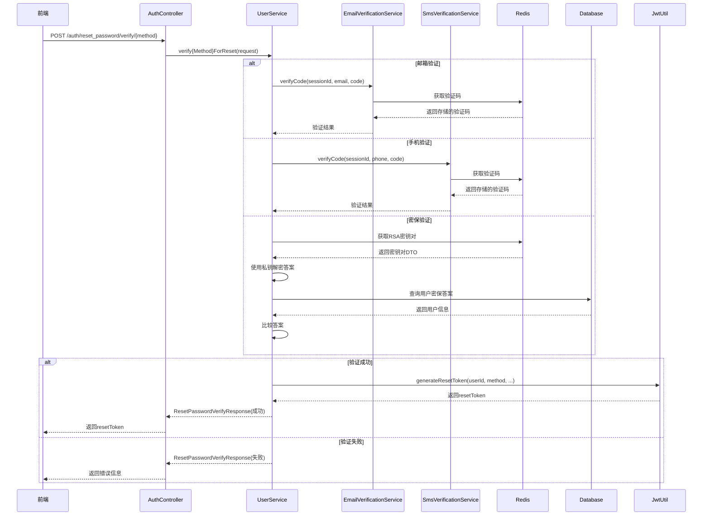

# 重置密码验证接口实现文档（第二步）

## 📋 概述

实现了重置密码功能的第二步：身份验证。包含三个验证接口：
1. 邮箱验证码验证
2. 手机验证码验证  
3. 密保问题答案验证

验证成功后返回 `resetToken`（JWT格式的临时令牌），用于第四步设置新密码。

---

## 🔧 实现内容

### 1. 新增DTO类（4个文件）

#### ResetPasswordEmailVerifyRequest.java
**路径**: `src/main/java/com/mizuka/cloudfilesystem/dto/ResetPasswordEmailVerifyRequest.java`

**字段**:
- `sessionId`: String - 第三步生成的新SessionId
- `email`: String - 用户邮箱（明文）
- `verificationCode`: String - 6位验证码（明文）

---

#### ResetPasswordPhoneVerifyRequest.java
**路径**: `src/main/java/com/mizuka/cloudfilesystem/dto/ResetPasswordPhoneVerifyRequest.java`

**字段**:
- `sessionId`: String - 第三步生成的新SessionId
- `phone`: String - 用户手机号（明文）
- `verificationCode`: String - 6位验证码（明文）

---

#### ResetPasswordSecurityVerifyRequest.java
**路径**: `src/main/java/com/mizuka/cloudfilesystem/dto/ResetPasswordSecurityVerifyRequest.java`

**字段**:
- `sessionId`: String - 第三步生成的新SessionId
- `userId`: Long - 用户ID（从第一步获取）
- `encryptedSecurityAnswer`: String - RSA加密的密保答案

---

#### ResetPasswordVerifyResponse.java
**路径**: `src/main/java/com/mizuka/cloudfilesystem/dto/ResetPasswordVerifyResponse.java`

**字段**:
- `code`: int - 响应代码
- `success`: boolean - 是否成功
- `message`: String - 响应消息
- `resetToken`: String - JWT格式的临时令牌（仅成功时返回）

---

### 2. 修改的文件

#### JwtUtil.java
**新增方法**:
```java
public String generateResetToken(Long userId, String verifiedBy, String email, String phone, Long expirationSeconds)
```

**功能**: 生成重置密码临时令牌（resetToken）
- 有效期：默认600秒（10分钟）
- 包含信息：userId、verifiedBy（验证方式）、email/phone

---

#### UserService.java
**新增方法**（3个）:

##### 1. verifyEmailForReset()
**功能**: 邮箱验证码验证
- 验证sessionId、email、verificationCode参数
- 调用 `emailVerificationService.verifyCode()` 验证验证码
- 查找用户
- 生成resetToken（verifiedBy="email"）

##### 2. verifyPhoneForReset()
**功能**: 手机验证码验证
- 验证sessionId、phone、verificationCode参数
- 调用 `smsVerificationService.verifyCode()` 验证验证码
- 查找用户
- 生成resetToken（verifiedBy="phone"）

##### 3. verifySecurityAnswerForReset()
**功能**: 密保问题答案验证
- 验证sessionId、userId、encryptedSecurityAnswer参数
- 从Redis获取RSA密钥对
- 使用私钥解密答案
- 查找用户并验证密保答案
- 生成resetToken（verifiedBy="security"）
- 清除RSA密钥对（一次性使用）

---

#### AuthController.java
**新增接口**（3个）:

##### 1. POST /auth/reset_password/verify/email
**功能**: 邮箱验证码验证接口
- 接收：ResetPasswordEmailVerifyRequest
- 返回：ResetPasswordVerifyResponse

##### 2. POST /auth/reset_password/verify/phone
**功能**: 手机验证码验证接口
- 接收：ResetPasswordPhoneVerifyRequest
- 返回：ResetPasswordVerifyResponse

##### 3. POST /auth/reset_password/verify/security_answer
**功能**: 密保问题答案验证接口
- 接收：ResetPasswordSecurityVerifyRequest
- 返回：ResetPasswordVerifyResponse

---

## 📊 接口详情

### 接口 1：邮箱验证码验证

**路径**: `POST /auth/reset_password/verify/email`

**请求示例**:
```json
{
  "sessionId": "new-uuid-here",
  "email": "user@example.com",
  "verificationCode": "123456"
}
```

**成功响应** (HTTP 200):
```json
{
  "code": 200,
  "success": true,
  "message": "验证成功",
  "resetToken": "eyJhbGciOiJIUzI1NiIsInR5cCI6IkpXVCJ9..."
}
```

**失败响应** (HTTP 400):
```json
{
  "code": 400,
  "success": false,
  "message": "验证码错误或已过期"
}
```

---

### 接口 2：手机验证码验证

**路径**: `POST /auth/reset_password/verify/phone`

**请求示例**:
```json
{
  "sessionId": "new-uuid-here",
  "phone": "13800138000",
  "verificationCode": "123456"
}
```

**成功响应**: 同邮箱验证

---

### 接口 3：密保问题答案验证

**路径**: `POST /auth/reset_password/verify/security_answer`

**请求示例**:
```json
{
  "sessionId": "new-uuid-here",
  "userId": 10001,
  "encryptedSecurityAnswer": "BASE64_ENCRYPTED_ANSWER"
}
```

**成功响应**: 同邮箱验证

**失败响应** (HTTP 400):
```json
{
  "code": 400,
  "success": false,
  "message": "密保答案错误"
}
```

---

## 🔐 安全特性

### 1. resetToken设计
- **JWT格式**：使用服务器端密钥签名，防止篡改
- **短有效期**：仅10分钟（600秒）
- **绑定验证方式**：token中包含 `verifiedBy` 字段（email/phone/security）
- **一次性使用**：建议在第四步使用后失效

### 2. SessionId管理
- **独立生成**：第三步使用新的SessionId，不与登录/注册混用
- **5分钟有效期**：每次成功请求后重置
- **上下文隔离**：每个验证流程有独立的会话

### 3. RSA加密
- **密保答案加密**：使用RSA公钥加密后传输
- **一次性密钥**：验证成功后清除RSA密钥对
- **防止重放**：密钥对5分钟后自动过期

### 4. 验证码复用
- **复用现有接口**：邮箱和手机验证码发送复用 `/auth/vfcode/email` 和 `/auth/vfcode/phone`
- **统一的管理逻辑**：减少后端接口数量
- **前端已有机制**：倒计时和重试机制已实现

---

## 📝 业务流程



---

## 🎯 关键设计决策

### 1. 为什么密保验证需要userId？

**原因**:
- 邮箱和手机可以直接通过邮箱/手机号查找用户
- 密保答案验证时，无法从答案反推用户
- 前端在第一步查找用户时已经获取了userId
- 要求前端传递userId简化了后端逻辑

**实现**:
```java
// 前端在第一步获取userId
const userInfo = await findUser(emailOrId);

// 第三步验证密保时传递userId
await verifySecurityAnswer({
  sessionId: newSessionId,
  userId: userInfo.id,  // ← 从第一步获取
  encryptedSecurityAnswer: encryptedAnswer
});
```

---

### 2. 为什么复用现有的验证码发送接口？

**优势**:
- ✅ 减少后端接口数量（不需要新增 `/auth/reset_password/send_email_code`）
- ✅ 统一的验证码管理逻辑（EmailVerificationService和SmsVerificationService）
- ✅ 前端已有完整的倒计时和重试机制
- ✅ 降低维护成本

**实现**:
```javascript
// 第三步发送验证码（复用现有接口）
await fetch('/auth/vfcode/email', {
  method: 'POST',
  body: JSON.stringify({
    sessionId: newSessionId,  // ← 使用新的sessionId
    email: userInfo.email
  })
});
```

---

### 3. resetToken的设计

**Payload结构**:
```json
{
  "userId": 10001,
  "verifiedBy": "email",  // 或 "phone" / "security"
  "email": "user@example.com",  // 仅邮箱验证时有值
  "phone": "13800138000",       // 仅手机验证时有值
  "iat": 1714636800,
  "exp": 1714637400  // 10分钟后过期
}
```

**使用场景**:
- 第四步设置新密码时需要携带此token
- 后端验证token的有效性
- 确保只有验证过的用户才能重置密码

---

## 🧪 测试方法

### 测试场景 1：邮箱验证成功

```bash
curl -X POST http://localhost:8835/auth/reset_password/verify/email \
  -H "Content-Type: application/json" \
  -d '{
    "sessionId": "test-session-1",
    "email": "user@example.com",
    "verificationCode": "123456"
  }'
```

**预期响应**:
```json
{
  "code": 200,
  "success": true,
  "message": "验证成功",
  "resetToken": "eyJhbGciOiJIUzI1NiIsInR5cCI6IkpXVCJ9..."
}
```

---

### 测试场景 2：手机验证成功

```bash
curl -X POST http://localhost:8835/auth/reset_password/verify/phone \
  -H "Content-Type: application/json" \
  -d '{
    "sessionId": "test-session-2",
    "phone": "13800138000",
    "verificationCode": "123456"
  }'
```

**预期响应**: 同邮箱验证

---

### 测试场景 3：密保验证成功

```bash
# 1. 先获取RSA公钥
curl -X POST http://localhost:8835/auth/rsa-key \
  -H "Content-Type: application/json" \
  -d '{"sessionId": "test-session-3"}'

# 2. 加密答案（前端使用jsencrypt库）
const encryptedAnswer = encryptWithPublicKey("北京", publicKey);

# 3. 验证密保答案
curl -X POST http://localhost:8835/auth/reset_password/verify/security_answer \
  -H "Content-Type: application/json" \
  -d '{
    "sessionId": "test-session-3",
    "userId": 10001,
    "encryptedSecurityAnswer": "BASE64_ENCRYPTED_ANSWER"
  }'
```

**预期响应**: 同邮箱验证

---

### 测试场景 4：验证码错误

```bash
curl -X POST http://localhost:8835/auth/reset_password/verify/email \
  -H "Content-Type: application/json" \
  -d '{
    "sessionId": "test-session-4",
    "email": "user@example.com",
    "verificationCode": "000000"
  }'
```

**预期响应**:
```json
{
  "code": 400,
  "success": false,
  "message": "验证码错误或已过期"
}
```

---

## 📋 文件清单

### 新增文件（4个）
- ✅ `src/main/java/com/mizuka/cloudfilesystem/dto/ResetPasswordEmailVerifyRequest.java`
- ✅ `src/main/java/com/mizuka/cloudfilesystem/dto/ResetPasswordPhoneVerifyRequest.java`
- ✅ `src/main/java/com/mizuka/cloudfilesystem/dto/ResetPasswordSecurityVerifyRequest.java`
- ✅ `src/main/java/com/mizuka/cloudfilesystem/dto/ResetPasswordVerifyResponse.java`

### 修改文件（3个）
- ✅ `src/main/java/com/mizuka/cloudfilesystem/util/JwtUtil.java`
- ✅ `src/main/java/com/mizuka/cloudfilesystem/service/UserService.java`
- ✅ `src/main/java/com/mizuka/cloudfilesystem/controller/AuthController.java`

---

## ⚠️ 注意事项

### 1. 前端实现要点

**第三步初始化**:
```javascript
// 1. 清除旧的SessionId
clearSessionId();

// 2. 生成新的SessionId
const newSessionId = crypto.randomUUID();

// 3. 获取新的RSA公钥（仅密保需要，但建议统一获取）
const rsaResponse = await fetch('/auth/rsa-key', {
  method: 'POST',
  body: JSON.stringify({ sessionId: newSessionId })
});
const publicKey = (await rsaResponse.json()).publicKey;

// 4. 根据验证方式显示不同界面
if (method === 'email' || method === 'phone') {
  // 自动发送验证码（复用现有接口）
  await sendVerificationCode(newSessionId, emailOrPhone);
}
```

---

### 2. SessionId管理

**重要规则**:
- ✅ 第三步开始时**必须**生成新的SessionId
- ✅ 不要复用第一步或登录时的SessionId
- ✅ 每次进入第三步都要重新生成
- ✅ 防止从第四步回退时使用旧的SessionId

**原因**:
- 防止验证码混乱
- 确保每次验证流程独立
- 避免SessionId过期或冲突

---

### 3. resetToken的使用

**第四步设置新密码时**:
```javascript
// 第四步请求需要携带resetToken
await fetch('/auth/reset_password/set_new_password', {
  method: 'POST',
  headers: {
    'Authorization': `Bearer ${resetToken}`  // ← 使用resetToken
  },
  body: JSON.stringify({
    newPassword: encryptedNewPassword,
    confirmPassword: encryptedConfirmPassword
  })
});
```

---

### 4. 数据库中的密保答案

**当前实现**: 假设数据库中存储的是明文答案
```java
if (!securityAnswer.equals(user.getSecurityAnswer())) {
    return new ResetPasswordVerifyResponse(400, false, "密保答案错误", null);
}
```

**如果需要哈希存储**:
```java
// 使用bcrypt比较
boolean isMatch = passwordEncoder.matches(securityAnswer, user.getSecurityAnswer());
if (!isMatch) {
    return new ResetPasswordVerifyResponse(400, false, "密保答案错误", null);
}
```

**建议**: 检查数据库中 `users.security_answer` 字段的存储方式，如果是明文则无需修改，如果是哈希则需要使用bcrypt比较。

---

## 🎯 下一步

1. ✅ 实现第四步：设置新密码接口（`POST /auth/reset_password/set_new_password`）
2. 添加频率限制，防止暴力破解
3. 添加IP限流机制
4. 完善日志记录和监控

---

**实现日期**: 2026-05-02  
**版本**: v1.0  
**作者**: Lingma AI Assistant  
**状态**: ✅ 已完成（待重启服务验证）
