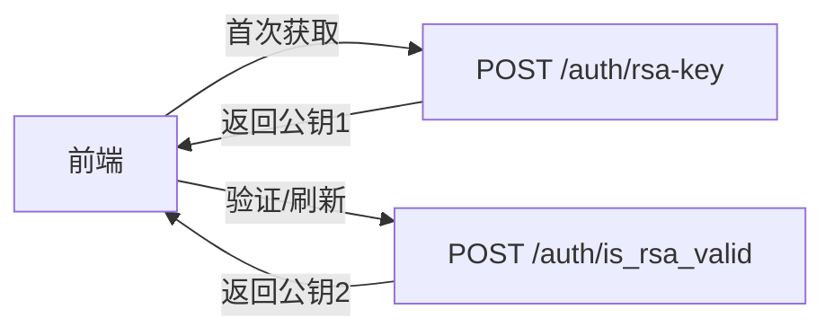
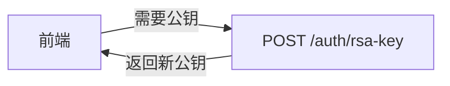

# RSA接口合并 - 简化公钥获取流程

## 📋 变更概述

将 `/auth/rsa-key` 和 `/auth/is_rsa_valid` 两个接口合并，前端只需要调用一个接口即可获取新的RSA公钥。

---

## 🔄 变更内容

### 删除的接口

**`POST /auth/is_rsa_valid`** - 已删除

**原因**：
- 该接口的功能与 `/auth/rsa-key` 重复
- 都需要生成新的密钥对
- 保留一个接口即可满足需求
- 简化API设计，降低维护成本

---

### 保留的接口

**`POST /auth/rsa-key`** - 保持不变

**功能**：
- 接收前端传来的sessionId
- 生成新的RSA密钥对
- 存储到Redis（key: `rsa:key:{sessionId}`）
- 返回公钥给前端
- TTL: 300秒（5分钟）

**请求示例**：
```bash
curl -X POST http://localhost:8080/auth/rsa-key \
  -H "Content-Type: application/json" \
  -d '{
    "sessionId": "a1b2c3d4-e5f6-7890-abcd-ef1234567890"
  }'
```

**响应示例**：
```json
{
  "code": 200,
  "success": true,
  "publicKey": "-----BEGIN PUBLIC KEY-----\nMIIBIjANBgkqhkiG9w0BAQEFAAOCAQ8A...\n-----END PUBLIC KEY-----"
}
```

---

## 📊 前后对比

### 变更前（两个接口）



**问题**：
- ❌ 两个接口功能重复
- ❌ 前端需要判断何时调用哪个接口
- ❌ 增加API复杂度
- ❌ 维护成本高

---

### 变更后（一个接口）



**优势**：
- ✅ 只有一个接口，简单明了
- ✅ 每次调用都生成新公钥
- ✅ 前端无需判断
- ✅ 降低维护成本

---

## 🎯 前端适配指南

### 变更前的调用方式

```javascript
// ❌ 旧方式：需要调用两个接口

// 1. 首次获取公钥
let sessionId = crypto.randomUUID();
let response = await fetch('/auth/rsa-key', {
  method: 'POST',
  headers: { 'Content-Type': 'application/json' },
  body: JSON.stringify({ sessionId })
});
let data = await response.json();
let publicKey = data.publicKey;

// 2. 后续需要刷新公钥时
response = await fetch('/auth/is_rsa_valid', {
  method: 'POST',
  headers: { 'Content-Type': 'application/json' },
  body: JSON.stringify({ 
    sessionId,
    publicKey  // 传入当前公钥
  })
});
data = await response.json();
publicKey = data.publicKey;  // 获取新公钥
```

---

### 变更后的调用方式

```javascript
// ✅ 新方式：只调用一个接口

// 任何时候需要公钥，都调用 /auth/rsa-key
let sessionId = crypto.randomUUID();

async function getPublicKey() {
  const response = await fetch('/auth/rsa-key', {
    method: 'POST',
    headers: { 'Content-Type': 'application/json' },
    body: JSON.stringify({ sessionId })
  });
  
  const data = await response.json();
  return data.publicKey;
}

// 首次获取
let publicKey = await getPublicKey();

// 需要刷新时，再次调用同一个接口
publicKey = await getPublicKey();  // 总是获取新公钥
```

---

## 📝 完整使用流程

### 1. 注册流程

```javascript
// 1. 生成sessionId
const sessionId = crypto.randomUUID();

// 2. 获取RSA公钥
const rsaResponse = await fetch('/auth/rsa-key', {
  method: 'POST',
  headers: { 'Content-Type': 'application/json' },
  body: JSON.stringify({ sessionId })
});
const rsaData = await rsaResponse.json();
const publicKey = rsaData.publicKey;

// 3. 发送邮箱验证码
await fetch('/auth/vfcode/email', {
  method: 'POST',
  headers: { 'Content-Type': 'application/json' },
  body: JSON.stringify({ 
    email: 'user@example.com',
    sessionId 
  })
});

// 4. 用户输入信息后，加密密码并注册
const encryptedPassword = encryptWithPublicKey(password, publicKey);

await fetch('/auth/register', {
  method: 'POST',
  headers: { 'Content-Type': 'application/json' },
  body: JSON.stringify({
    sessionId,
    data: [{
      nickname: '张三',
      email: 'user@example.com',
      encryptedPassword,
      emailVfCode: '123456',
      securityQuestion: 1,
      securityAnswer: '答案'
    }]
  })
});
```

---

### 2. 登录流程

```javascript
// 1. 生成或读取sessionId
let sessionId = localStorage.getItem('sessionId');
if (!sessionId) {
  sessionId = crypto.randomUUID();
  localStorage.setItem('sessionId', sessionId);
}

// 2. 获取RSA公钥
const rsaResponse = await fetch('/auth/rsa-key', {
  method: 'POST',
  headers: { 'Content-Type': 'application/json' },
  body: JSON.stringify({ sessionId })
});
const rsaData = await rsaResponse.json();
const publicKey = rsaData.publicKey;

// 3. 加密密码并登录
const encryptedPassword = encryptWithPublicKey(password, publicKey);

const loginResponse = await fetch('/auth/login', {
  method: 'POST',
  headers: { 'Content-Type': 'application/json' },
  body: JSON.stringify({
    sessionId,
    userId: 'zhangsan',
    encryptedPassword,
    tokenExpiration: 604800
  })
});

const loginData = await loginResponse.json();
const jwtToken = loginData.token;
```

---

### 3. 修改邮箱流程

```javascript
// 1. 获取RSA公钥（如果需要）
const rsaResponse = await fetch('/auth/rsa-key', {
  method: 'POST',
  headers: { 'Content-Type': 'application/json' },
  body: JSON.stringify({ sessionId })
});
const rsaData = await rsaResponse.json();
const publicKey = rsaData.publicKey;

// 2. 发送邮箱验证码到新邮箱
await fetch('/auth/vfcode/email', {
  method: 'POST',
  headers: { 'Content-Type': 'application/json' },
  body: JSON.stringify({ 
    email: 'newemail@example.com',
    sessionId 
  })
});

// 3. 加密新邮箱并提交修改
const encryptedEmail = encryptWithPublicKey('newemail@example.com', publicKey);

await fetch('/profile/email/set', {
  method: 'POST',
  headers: { 
    'Content-Type': 'application/json',
    'Authorization': `Bearer ${jwtToken}`
  },
  body: JSON.stringify({
    sessionId,
    encryptedEmail,
    verificationCode: '123456'
  })
});
```

---

### 4. 修改手机号流程

```javascript
// 1. 获取RSA公钥（如果需要）
const rsaResponse = await fetch('/auth/rsa-key', {
  method: 'POST',
  headers: { 'Content-Type': 'application/json' },
  body: JSON.stringify({ sessionId })
});
const rsaData = await rsaResponse.json();
const publicKey = rsaData.publicKey;

// 2. 发送短信验证码到新手机号
await fetch('/auth/vfcode/phone', {
  method: 'POST',
  headers: { 'Content-Type': 'application/json' },
  body: JSON.stringify({ 
    phoneNumber: '13800138000',
    sessionId 
  })
});

// 3. 加密新手机号并提交修改
const encryptedPhone = encryptWithPublicKey('13800138000', publicKey);

await fetch('/profile/phone/set', {
  method: 'POST',
  headers: { 
    'Content-Type': 'application/json',
    'Authorization': `Bearer ${jwtToken}`
  },
  body: JSON.stringify({
    sessionId,
    encryptedPhone,
    verificationCode: '123456'
  })
});
```

---

### 5. 修改密码流程

```javascript
// 1. 获取RSA公钥
const rsaResponse = await fetch('/auth/rsa-key', {
  method: 'POST',
  headers: { 'Content-Type': 'application/json' },
  body: JSON.stringify({ sessionId })
});
const rsaData = await rsaResponse.json();
const publicKey = rsaData.publicKey;

// 2. 加密旧密码和新密码
const encryptedOldPassword = encryptWithPublicKey(oldPassword, publicKey);
const encryptedNewPassword = encryptWithPublicKey(newPassword, publicKey);

// 3. 提交修改
await fetch('/profile/password/change', {
  method: 'POST',
  headers: { 
    'Content-Type': 'application/json',
    'Authorization': `Bearer ${jwtToken}`
  },
  body: JSON.stringify({
    sessionId,
    oldPassword: encryptedOldPassword,
    newPassword: encryptedNewPassword
  })
});
```

---

## 🔑 关键原则

### 1. SessionId管理

```javascript
// ✅ 推荐：在应用启动时生成一次，然后复用
let sessionId = localStorage.getItem('rsa_session_id');
if (!sessionId) {
  sessionId = crypto.randomUUID();
  localStorage.setItem('rsa_session_id', sessionId);
}

// ❌ 不推荐：每次请求都生成新的sessionId
const sessionId = crypto.randomUUID();  // 每次都生成
```

---

### 2. 公钥获取时机

```javascript
// ✅ 推荐：在需要加密数据前获取公钥
async function encryptAndSend(data) {
  // 1. 获取公钥
  const publicKey = await getPublicKey();
  
  // 2. 加密数据
  const encryptedData = encryptWithPublicKey(data, publicKey);
  
  // 3. 发送请求
  await sendData(encryptedData);
}

// ❌ 不推荐：提前很久获取公钥，可能导致过期
const publicKey = await getPublicKey();  // 早上获取
// ... 几小时后 ...
const encryptedData = encryptWithPublicKey(data, publicKey);  // 可能已过期
```

---

### 3. 错误处理

```javascript
async function getPublicKey() {
  try {
    const response = await fetch('/auth/rsa-key', {
      method: 'POST',
      headers: { 'Content-Type': 'application/json' },
      body: JSON.stringify({ sessionId })
    });
    
    if (!response.ok) {
      throw new Error(`HTTP error! status: ${response.status}`);
    }
    
    const data = await response.json();
    
    if (!data.success) {
      throw new Error(data.message || '获取公钥失败');
    }
    
    return data.publicKey;
  } catch (error) {
    console.error('获取公钥失败:', error);
    // 可以重试或提示用户
    throw error;
  }
}
```

---

## 🧪 测试验证

### 测试1：连续调用获取不同公钥

```bash
# 1. 第一次调用
echo "=== 第一次调用 ==="
curl -X POST http://localhost:8080/auth/rsa-key \
  -H "Content-Type: application/json" \
  -d '{"sessionId": "test-session-1"}' | jq '.publicKey' > /tmp/key1.txt

# 2. 等待1秒
sleep 1

# 3. 第二次调用（相同sessionId）
echo "=== 第二次调用 ==="
curl -X POST http://localhost:8080/auth/rsa-key \
  -H "Content-Type: application/json" \
  -d '{"sessionId": "test-session-1"}' | jq '.publicKey' > /tmp/key2.txt

# 4. 比较结果
echo "=== 比较结果 ==="
if diff /tmp/key1.txt /tmp/key2.txt > /dev/null; then
  echo "❌ 失败：两次返回的公钥相同"
else
  echo "✅ 成功：两次返回的公钥不同"
fi
```

**预期结果**：
```
=== 第一次调用 ===
"-----BEGIN PUBLIC KEY-----\nKEY1...\n-----END PUBLIC KEY-----"

=== 第二次调用 ===
"-----BEGIN PUBLIC KEY-----\nKEY2...\n-----END PUBLIC KEY-----"

=== 比较结果 ===
✅ 成功：两次返回的公钥不同
```

---

### 测试2：验证Redis中的密钥对更新

```bash
# 1. 第一次调用
SESSION_ID="test-session-$(date +%s)"
curl -X POST http://localhost:8080/auth/rsa-key \
  -H "Content-Type: application/json" \
  -d "{\"sessionId\": \"$SESSION_ID\"}"

# 2. 检查Redis
echo "=== 第一次调用后的Redis ==="
redis-cli GET "rsa:key:$SESSION_ID" | jq '.publicKey'

# 3. 等待1秒
sleep 1

# 4. 第二次调用
curl -X POST http://localhost:8080/auth/rsa-key \
  -H "Content-Type: application/json" \
  -d "{\"sessionId\": \"$SESSION_ID\"}"

# 5. 再次检查Redis
echo "=== 第二次调用后的Redis ==="
redis-cli GET "rsa:key:$SESSION_ID" | jq '.publicKey'
```

**预期结果**：
```
=== 第一次调用后的Redis ===
"-----BEGIN PUBLIC KEY-----\nKEY1...\n-----END PUBLIC KEY-----"

=== 第二次调用后的Redis ===
"-----BEGIN PUBLIC KEY-----\nKEY2...\n-----END PUBLIC KEY-----"
```

---

## ⚠️ 注意事项

### 1. 接口已删除

**`POST /auth/is_rsa_valid`** 已被删除，前端不应该再调用此接口。

如果前端仍在调用，会收到 **404 Not Found** 错误。

---

### 2. 统一使用 `/auth/rsa-key`

所有需要获取RSA公钥的场景，都应该调用 `/auth/rsa-key` 接口：
- ✅ 注册前获取公钥
- ✅ 登录前获取公钥
- ✅ 修改邮箱前获取公钥
- ✅ 修改手机号前获取公钥
- ✅ 修改密码前获取公钥
- ✅ 任何需要加密敏感数据前获取公钥

---

### 3. 公钥有效期

- **TTL**: 300秒（5分钟）
- **建议**: 在需要加密数据前立即获取公钥，不要提前太久
- **过期处理**: 如果密钥对已过期，后端会返回错误，前端需要重新获取公钥

---

### 4. SessionId复用

- **推荐**: 生成一次sessionId，然后在整个会话期间复用
- **存储**: 可以存储在 `localStorage` 或组件state中
- **不要**: 每次请求都生成新的sessionId

---

## 📋 迁移清单

### 前端需要做的修改

- [ ] 移除所有对 `/auth/is_rsa_valid` 的调用
- [ ] 将所有获取公钥的逻辑改为调用 `/auth/rsa-key`
- [ ] 简化公钥管理逻辑（不再需要判断何时刷新）
- [ ] 测试所有使用RSA加密的功能（注册、登录、修改邮箱、修改手机号、修改密码）
- [ ] 更新API文档和注释

---

### 后端已完成的修改

- [x] 删除 `/auth/is_rsa_valid` 接口
- [x] 保留 `/auth/rsa-key` 接口
- [x] 验证代码无编译错误
- [x] 更新相关文档

---

## 🎯 总结

### 变更优势

1. **简化API**：从两个接口减少到一个
2. **降低复杂度**：前端不需要判断调用哪个接口
3. **提高一致性**：所有场景都使用同一个接口
4. **易于维护**：减少代码量，降低维护成本

### 核心原则

- ✅ 任何时候需要公钥，都调用 `/auth/rsa-key`
- ✅ 每次调用都会生成新的密钥对
- ✅ SessionId应该复用，不要每次生成新的
- ✅ 在需要加密数据前立即获取公钥

### 前端适配

- ❌ 不再调用 `/auth/is_rsa_valid`
- ✅ 统一调用 `/auth/rsa-key`
- ✅ 简化公钥管理逻辑

---

**变更日期**: 2026-05-02  
**版本**: v1.0  
**作者**: Lingma AI Assistant  
**状态**: ✅ 已完成
