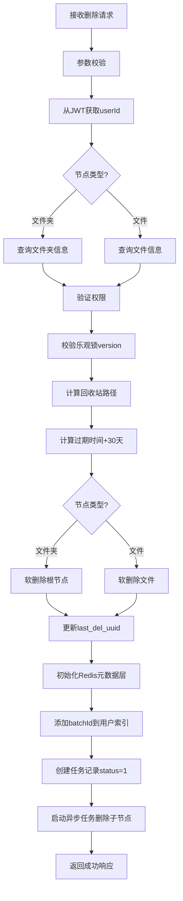

# 删除节点接口文档 (TEMP_DELETE.md)

## 📋 概述

删除节点接口用于将文件或文件夹**软删除**并移入回收站。删除后的节点会在回收站中保留30天，之后自动彻底删除。该接口采用**乐观锁**机制保证并发安全，并使用**Redis元数据层**管理删除批次。

---

## 🔗 接口信息

### 基本信息
- **路径**: `DELETE /files/delete`
- **认证**: 需要JWT Token
- **Content-Type**: `application/x-www-form-urlencoded`

### 请求参数

| 参数名 | 类型 | 必填 | 说明 |
|--------|------|------|------|
| nodeId | Long | 是 | 节点ID（文件夹或文件ID） |
| nodeType | Integer | 是 | 节点类型：0=文件夹，1=文件 |
| version | Long | 是 | 乐观锁版本号 |
| batchId | String | 否 | 业务操作批次号（UUID格式），不传则自动生成 |

### 响应格式

```json
{
  "code": 200,
  "success": true,
  "message": "已移入回收站，30天后彻底删除",
  "data": {
    "recycleBinPath": "/_root/_recycle_bin/10001/test_folder",
    "expiresAt": "2026-07-07T15:30:00"
  }
}
```

### 响应字段说明

#### data 对象
| 字段 | 类型 | 说明 |
|------|------|------|
| recycleBinPath | String | 回收站中的完整路径 |
| expiresAt | LocalDateTime | 过期时间（删除后30天） |

---

## 🏗️ 实现逻辑

### 核心特性

1. **软删除**：不是物理删除，而是标记为回收站状态
2. **乐观锁**：通过version字段防止并发冲突
3. **批量管理**：使用batchId关联同一批次的删除操作
4. **Redis缓存**：使用元数据层快速查询删除记录
5. **异步处理**：文件夹的子节点异步递归删除

### 执行流程



### 详细步骤

#### 1. 参数校验（FileController.deleteNode）
```java
// 从JWT获取用户ID
Long userId = SecurityUtils.getCurrentUserId();

// 参数校验
if (nodeId == null) {
    return Result.error(40001, "节点ID不能为空");
}

if (nodeType == null) {
    return Result.error(40001, "节点类型不能为空");
}

if (version == null) {
    return Result.error(40001, "版本号不能为空");
}

// 如果前端没有传batchId，后端生成一个UUID
if (batchId == null || batchId.trim().isEmpty()) {
    batchId = java.util.UUID.randomUUID().toString();
}
```

#### 2. 文件夹删除逻辑（DirectoryService.deleteNodeWithBatchId）
```java
if (nodeType == 0) {
    // 查询文件夹信息
    FolderNode folder = folderNodeMapper.findById(nodeId);
    
    if (folder == null) {
        throw new RuntimeException("文件夹不存在");
    }
    
    // 验证权限
    if (folder.getUserId() != null && !userId.equals(folder.getUserId())) {
        throw new RuntimeException("无权删除该文件夹");
    }
    
    // 乐观锁校验
    if (!folder.getVersion().equals(version)) {
        throw new OptimisticLockException(
            "文件夹已被其他人修改，请刷新后重试"
        );
    }
    
    // 计算回收站路径和过期时间
    String recycleBinPath = calculateRecycleBinPath(folder.getPath(), userId);
    LocalDateTime expiresAt = LocalDateTime.now().plusDays(30);
    
    // 【关键】只更新根节点状态，不扫描子节点
    softDeleteFolderRoot(nodeId, recycleBinPath, expiresAt);
    
    // 更新节点的last_del_uuid
    folderNodeMapper.updateLastDelUuid(nodeId, batchId);
    
    log.info("用户 {} 软删除文件夹根节点 - NodeId: {}, BatchId: {}", userId, nodeId, batchId);
}
```

#### 3. 文件删除逻辑
```java
else if (nodeType == 1) {
    // 查询文件信息
    FileNode file = fileNodeMapper.findById(nodeId);
    
    if (file == null) {
        throw new RuntimeException("文件不存在");
    }
    
    // 验证权限
    if (file.getUserId() != null && !userId.equals(file.getUserId())) {
        throw new RuntimeException("无权删除该文件");
    }
    
    // 乐观锁校验
    if (!file.getVersion().equals(version)) {
        throw new OptimisticLockException(
            "文件已被其他人修改，请刷新后重试"
        );
    }
    
    // 计算回收站路径和过期时间
    String recycleBinPath = calculateRecycleBinPath(file.getPath(), userId);
    LocalDateTime expiresAt = LocalDateTime.now().plusDays(30);
    
    // 执行软删除
    softDeleteFile(nodeId, recycleBinPath, expiresAt);
    
    // 更新文件的last_del_uuid
    fileNodeMapper.updateLastDelUuid(nodeId, batchId);
    
    log.info("用户 {} 软删除文件 - NodeId: {}, BatchId: {}", userId, nodeId, batchId);
}
```

#### 4. Redis元数据层初始化
```java
// 初始化Redis元数据层（只需知道是文件夹还是文件类型）
Map<String, String> rootInfo = new HashMap<>();
rootInfo.put("rootNodeId", String.valueOf(nodeId));
rootInfo.put("nodeType", String.valueOf(nodeType));
rootInfo.put("userId", String.valueOf(userId));
rootInfo.put("batchId", batchId);
rootInfo.put("createdAt", String.valueOf(System.currentTimeMillis()));
rootInfo.put("deletedAt", String.valueOf(System.currentTimeMillis()));
rootInfo.put("expiresAt", String.valueOf(System.currentTimeMillis() + 30L * 24 * 3600 * 1000));

recycleBinRedisService.cacheBatchInfo(batchId, rootInfo);

// 添加batchId到用户索引列表
recycleBinRedisService.addBatchToUserList(userId, batchId, LocalDateTime.now());
```

#### 5. 创建任务记录
```java
// 创建任务记录（status=1表示已完成，因为不需要异步扫描）
RecycleBinTask task = new RecycleBinTask();
task.setBatchId(batchId);
task.setUserId(userId);
task.setRootNodeId(nodeId);
task.setNodeType(nodeType);
task.setOperationType(0); // 删除操作
task.setStatus(1); // 已完成（不再需要异步扫描）
task.setProcessedCount(1); // 始终为1
task.setTotalCount(1); // 始终为1
task.setCreatedAt(LocalDateTime.now());
task.setCompletedAt(LocalDateTime.now());

Long taskId = recycleBinTaskMapper.insert(task);
log.info("创建回收站任务 - BatchId: {}, TaskId: {}, Status: 已完成", batchId, taskId);
```

#### 6. 异步删除子节点（仅文件夹）
```java
// 对于文件夹，启动后台异步任务递归删除子节点
if (nodeType == 0) {
    asyncDirectoryDeleteService.asyncDeleteFolderWithBatchId(
        nodeId, batchId, userId, recycleBinPath, expiresAt
    );
}
```

---

## 🔒 乐观锁机制

### 工作原理

1. **读取时获取version**：前端在删除前先查询节点信息，获取当前version
2. **删除时校验version**：后端校验传入的version与数据库中的version是否一致
3. **不一致则拒绝**：如果不一致，说明节点已被其他操作修改，拒绝删除

### 示例

```bash
# 1. 先查询节点信息
GET /files/browse?currentNodeId=123
Response: {
  "children": [
    {
      "id": 456,
      "name": "test.txt",
      "version": 5
    }
  ]
}

# 2. 删除时传入version
DELETE /files/delete?nodeId=456&nodeType=1&version=5
```

### 冲突处理

如果发生版本冲突，返回409错误：

```json
{
  "code": 409,
  "success": false,
  "message": "文件夹已被其他人修改，请刷新后重试",
  "data": null
}
```

---

## 🔄 异步删除机制

### 文件夹异步删除

对于文件夹，只立即删除根节点，子节点通过异步任务递归删除：

```java
@Async("deleteTaskExecutor")
public void asyncDeleteFolderWithBatchId(Long folderId, String batchId, Long userId,
                                          String recycleBinPath, LocalDateTime expiresAt) {
    try {
        // 1. 统计需要删除的节点总数
        int totalNodes = countNodesToDelete(folderId);
        recycleBinTaskMapper.updateProgress(batchId, 0, totalNodes);
        
        // 2. 分批递归删除所有子节点
        int processedNodes = 0;
        
        // 先删除所有子文件夹
        processedNodes += deleteChildFoldersWithBatchId(folderId, batchId, userId, 
            recycleBinPath, expiresAt, processedNodes, totalNodes);
        
        // 再删除所有子文件
        processedNodes += deleteChildFilesWithBatchId(folderId, batchId, userId, 
            recycleBinPath, expiresAt, processedNodes, totalNodes);
        
        // 3. 更新任务状态为完成
        recycleBinTaskMapper.updateTask(batchId, 1, LocalDateTime.now(), null, 
            processedNodes, totalNodes);
        
        log.info("[异步删除] 完成 - FolderId: {}, BatchId: {}, Processed: {}/{}", 
            folderId, batchId, processedNodes, totalNodes);
        
    } catch (Exception e) {
        log.error("[异步删除] 失败 - FolderId: {}, BatchId: {}", folderId, batchId, e);
        recycleBinTaskMapper.updateTask(batchId, 2, LocalDateTime.now(), 
            e.getMessage(), null, null);
    }
}
```

### 限流控制

异步删除过程中使用滑动窗口限流器：

```java
// 限流控制
String rateLimitKey = "rate_limit:delete:" + userId;
try {
    rateLimiterService.acquireWithBackoff(rateLimitKey, DEFAULT_MAX_IOPS);
} catch (InterruptedException e) {
    Thread.currentThread().interrupt();
    throw new RuntimeException("删除任务被中断", e);
}
```

---

## 💾 Redis存储结构

### 1. 元数据层
**Key**: `recycle:batch:{batchId}:info`  
**Type**: Hash  
**TTL**: 30天

```
{
  "rootNodeId": "12345",
  "nodeType": "0",
  "userId": "10001",
  "batchId": "a1b2c3d4-e5f6-7890-abcd-ef1234567890",
  "createdAt": "1717747800000",
  "deletedAt": "1717747800000",
  "expiresAt": "1720339800000"
}
```

### 2. 索引层
**Key**: `recycle:user:{userId}:batches`  
**Type**: ZSET  
**TTL**: 30天

```
Member: "a1b2c3d4-e5f6-7890-abcd-ef1234567890"
Score: 1717747800000 (删除时间戳)
```

---

## 🛡️ 错误处理

### 常见错误码

| 错误码 | 说明 | 原因 |
|--------|------|------|
| 401 | 未认证 | JWT Token无效或过期 |
| 40001 | 参数错误 | 缺少必填参数或参数格式错误 |
| 40301 | 权限不足 | 无权删除该节点 |
| 40401 | 资源不存在 | 节点ID不存在 |
| 409 | 版本冲突 | 乐观锁校验失败 |
| 50001 | 服务器错误 | 系统异常 |

### 错误响应示例

```json
{
  "code": 40301,
  "success": false,
  "message": "无权删除该文件夹",
  "data": null
}
```

---

## 📊 性能优化

### 1. 延迟加载子节点
- 文件夹删除时只立即处理根节点
- 子节点通过异步任务递归删除
- 避免大文件夹删除阻塞主线程

### 2. Redis缓存
- 使用元数据层快速查询删除记录
- 减少MySQL查询次数

### 3. 批量操作
- 异步删除时使用批量SQL
- 每批最多处理100个节点

### 4. 限流保护
- 使用滑动窗口限流器
- 默认每秒最多1000次操作

---

## 🔍 相关接口

### 1. 浏览回收站
- **路径**: `GET /files/recycle`
- **功能**: 查看已删除的节点列表

### 2. 恢复节点
- **路径**: `POST /files/recycle/restore`
- **功能**: 从回收站恢复节点

### 3. 彻底删除
- **路径**: `DELETE /files/delete/permanent`
- **功能**: 从回收站永久删除节点

---

## 📝 注意事项

1. **权限控制**：只能删除自己拥有的节点
2. **乐观锁**：必须先查询获取version，再删除
3. **过期时间**：删除后30天自动彻底删除
4. **异步处理**：大文件夹的子节点异步删除，可能需要时间
5. **batchId管理**：每个删除操作都有唯一的batchId
6. **last_del_uuid**：用于追踪节点的最后一次删除操作

---

## 🧪 测试示例

### cURL测试

```bash
# 删除文件夹
curl -X DELETE "http://localhost:8080/files/delete?nodeId=123&nodeType=0&version=5" \
  -H "Authorization: Bearer YOUR_JWT_TOKEN"

# 删除文件
curl -X DELETE "http://localhost:8080/files/delete?nodeId=456&nodeType=1&version=3" \
  -H "Authorization: Bearer YOUR_JWT_TOKEN"

# 带自定义batchId
curl -X DELETE "http://localhost:8080/files/delete?nodeId=123&nodeType=0&version=5&batchId=my-custom-batch-id" \
  -H "Authorization: Bearer YOUR_JWT_TOKEN"
```

### JavaScript测试

```javascript
// 删除文件夹
const response = await fetch('/files/delete?nodeId=123&nodeType=0&version=5', {
  method: 'DELETE',
  headers: {
    'Authorization': 'Bearer YOUR_JWT_TOKEN'
  }
});
const data = await response.json();

console.log('删除成功:', data.data.recycleBinPath);
console.log('过期时间:', data.data.expiresAt);
```

---

## 📚 技术栈

- **Spring Boot**: Web框架
- **MyBatis**: ORM框架
- **Redis**: 缓存层（Lettuce客户端）
- **JWT**: 身份认证
- **@Async**: 异步任务处理
- **Lombok**: 简化代码

---

## 🔄 版本历史

- **v1.0** (2026-06-01): 初始版本，基于MySQL
- **v2.0** (2026-06-07): 新增Redis元数据层
- **v3.0** (2026-06-09): 优化异步删除机制，支持batchId管理
